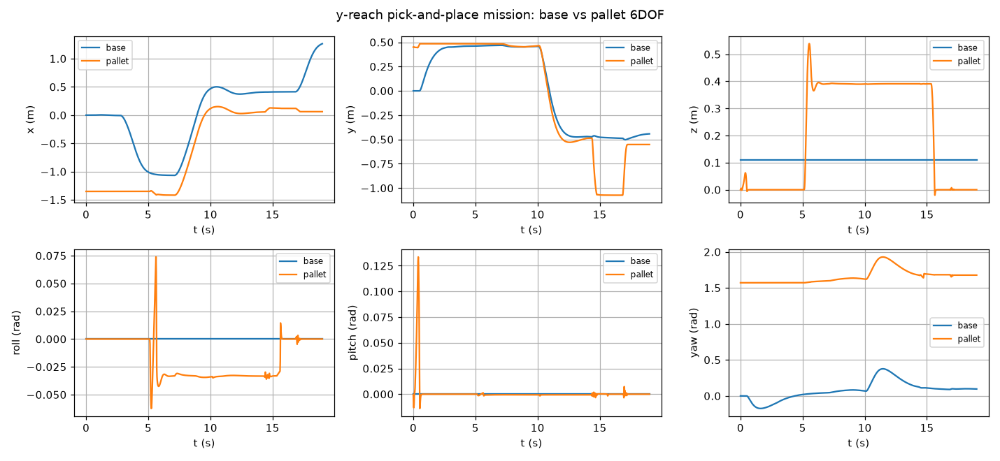

# MuJoCo 繁體中文教學與模擬實驗

用 MuJoCo 物理引擎寫的 27 篇繁體中文教學、34 支 Python 腳本，以及一整條 AMR 叉車搬運實驗線 —
從盒子堆出來的簡化模型，一路做到真實 mesh 舵輪叉車的完整取放任務。每個實驗都留下影片、
CSV 軌跡記錄與實測數字，文件裡的每個數字都能在對應的 log 找到出處。

**線上閱讀：<https://wicanr2.github.io/mujoco-tutorial-zh/>**

[教學索引](docs/README.md)｜[實驗紀錄](runs/README.md)｜[完整成果報告](REPORT.md)｜[協作規範](AGENTS.md)


---

## AMR 叉車搬運實驗

這條線佔了一半篇幅，也是最完整的部分。從最簡單的「牙叉插進棧板底下」開始，逐步換成真實
mesh 車體、真實舵輪底盤、真實貨架，最後串成完整的搬運任務。

| 實驗 | 做了什麼 | 實測結果 |
| --- | --- | --- |
| [13 叉車建模](docs/06-amr/01-amr-forklift.md) | 取貨五階段：對位→接近→降叉→插入→抬升 | 棧板抬到 z=0.14 m |
| [14 車載手臂 IK](docs/06-amr/02-mobile-manipulator.md) | 三軸手臂 + 阻尼最小平方法 IK | 末端誤差 2.6 cm |
| [15 六軸 6D IK](docs/06-amr/03-ik-6d.md) | 位置與姿態同時收斂 | 30 次迭代，1.1 cm / 0.036 rad |
| [16 棧板材質](docs/06-amr/04-pallet-materials.md) | 木頭 μ=0.6 vs 塑膠 μ=0.35，20 kg 急側移 | 木 0.4 cm、塑膠 11.9 cm 滑動 |
| [17 門架前傾](docs/06-amr/05-tilt-boundary.md) | 12 秒緩慢傾到 45°，掃滑落邊界 | 木 25.9°、塑膠 26.1° 開始滑；45° 內未掉落 |
| [18 MR1533 mesh](docs/06-amr/06-mr1533-mesh.md) | TB3 實驗的真實叉車 mesh 匯入 MJCF | 升降 0.951 m、前傾 9.5° |
| [19 Blender 棧板](docs/06-amr/07-blender-pallet.md) | 程序化建模歐規棧板，STL 匯入 | 兩材質上下左右皆未掉落 |
| [20 真實模型重跑](docs/06-amr/08-rerun-real-model.md) | 把 16/17 章搬到 2000 kg 真車上 | 兩材質滑動量都是 15.7 cm（見下方結論） |
| [21 y-reach 車型](docs/06-amr/09-yreach.md) | Blender 建側移滑台掛上 MR1533 | reach ±0.45 m，升降不受影響 |
| [22 取放任務](docs/06-amr/10-yreach-mission.md) | 完整 pick-and-place，閉迴圈 P 控制 | 19 秒完成，棧板搬移 1.4 m |
| [23 連續動作](docs/06-amr/11-fork-cyclic.md) | 載貨升降 ×3 + 側移 ×3 | 漂移從 22 cm 降到 1.4 cm |
| [24 貨架取放 X/Z](docs/06-amr/12-steer-reach-xz.md) | 舵輪底盤 + 環氧地板 + 層板取貨 | 深插取貨、離架後放下 |
| [25 全軸取放 X/Y/Z](docs/06-amr/13-reach-xyz.md) | 加上 y 向 reach 側移放置 | 三軸都有實際作用 |
| [26 夾爪 A 取 B 放](docs/06-amr/14-gripper-ab.md) | 三軸手臂 + 二指夾爪 + weld 抓取 | 箱子準確落在 B 桌面 |
| [27 舵輪繞圈](docs/06-amr/15-steer-loop.md) | 2×2 m 正方形 waypoint 追蹤 | 8 個點到達 7 個，轉彎外擺 0.41 m |

錄影與軌跡記錄（欄位說明見 [runs/README.md](runs/README.md)）：

| 影片 | 內容 |
| --- | --- |
| [mission.mp4](runs/mission.mp4) | 完整取放任務 19 秒，571 幀 |
| [fork_cyclic.mp4](runs/fork_cyclic.mp4) | 載貨連續升降與側移 27.7 秒，831 幀 |
| [reach_xz.mp4](runs/reach_xz.mp4)｜[reach_xyz.mp4](runs/reach_xyz.mp4) | 貨架取放，reach X/Z 與 X/Y/Z |
| [gripper.mp4](runs/gripper.mp4) | 夾爪 A 桌取箱、B 桌放下 |
| [loop.mp4](runs/loop.mp4) | 舵輪繞圈 waypoint 追蹤，4500 幀 |



## 強化學習對照

同一個單擺 swing-up 任務，三種演算法、四種配置跑下來的結果：

| 方法 | 最終回報 | 訓練時間 | 硬體 | 章節 |
| --- | --- | --- | --- | --- |
| ARS（手寫 numpy） | -0.30 | 21 秒 | CPU | [08](docs/02-programming/03-rl-swingup.md) |
| PPO（SB3，150k 步） | -0.11 | 6 分鐘 | CPU | [09](docs/02-programming/04-ppo-gymnasium.md) |
| SAC（SB3，60k 步） | 未收斂 | 30 分鐘 | CPU | [12](docs/02-programming/07-sac.md) |
| SAC（zoo 超參，60k 步） | -0.21 | 4 分鐘 | RTX Pro 6000 | [12](docs/02-programming/07-sac.md) |

SAC 在 CPU 上沒學起來，不是環境或回報設計有問題（同一個環境 PPO 與 ARS 都收斂），而是
off-policy 演算法需要夠高的更新頻率；CPU 被迫把 `train_freq` 調低就學不動，換 GPU 補回來
之後 60k 步就收斂 — 比 PPO 少一半以上的樣本。訓練好的權重都收在 [`policies/`](policies/)，
可以直接載入試玩。

## 幾個值得記下來的結論

**實驗平台決定你能觀測到什麼。** 16 章用輕量車 + 專用側移關節，測得木頭與塑膠棧板的滑動量
差了 30 倍（0.4 cm vs 11.9 cm）；20 章換成 2000 kg 的真實叉車重跑，兩種材質的滑動量都是
15.7 cm，一模一樣。不是模型錯了 — 重車沒有側移機構，橫移只能靠底盤加減速，力道不是太小
（兩者都不滑）就是太大（兩者都滑到飽和），中間那段能分辨材質的區間做不出來。換「更真實」
的模型不是免費升級，實驗設計要跟著改。

**MuJoCo 的接觸摩擦取兩個 geom 的最大值。** 牙叉設 μ=1.0 時，棧板無論設 0.6 還是 0.35 都
被蓋掉，材質實驗會得到兩組一模一樣的數字。要讓某一端的材質生效，另一端得調低。

**「關節不動」十次有八次是機構內部零件互相摩擦鎖死。** 裝飾輪與地面、滑架與門架、叉齒與
底盤，這個坑在本專案出現了三次。解法是把內部零件的碰撞關掉，或用 `contact/exclude` 排除。

**掉落判定不能用絕對高度。** 門架前傾本身就會讓棧板降低，17 章第一版用「高度 < 5 cm」判定，
結果 10.8° 就全部誤報掉落。要判翻倒就量姿態角，要判滑出就量相對位移。

**真實叉車的後傾技巧在模擬裡同樣有效。** 23 章連續升降時棧板每次落底都往叉尖蠕動一點，
累積 22 cm；把門架後傾 0.08 rad 讓貨靠上滑架背板之後，漂移降到 1.4 cm。

二十五條除錯案例的完整清單在 [REPORT.md](REPORT.md)，每一條在對應章節都有現象、原因與解法。

## 教學目錄

完整索引在 [docs/README.md](docs/README.md)。

**基礎**：[01 導論與安裝](docs/00-intro/01-what-is-mujoco.md)｜[02 MJCF 建模](docs/01-basics/01-mjcf-basics.md)｜[03 程式設計入門](docs/02-programming/01-simulation-loop.md)｜[04 URDF 匯入](docs/03-urdf-import/01-import-urdf.md)｜[05 Isaac Sim 整合](docs/04-isaac-sim/01-isaac-sim-mujoco.md)｜[06 Gazebo 整合](docs/05-gazebo/01-gazebo-mujoco.md)

**程式設計與 RL**：[07 五個 Python 範例](docs/02-programming/02-more-examples.md)｜[08 ARS 手寫 RL](docs/02-programming/03-rl-swingup.md)｜[09 Gymnasium + PPO](docs/02-programming/04-ppo-gymnasium.md)｜[10 車桿 swing-up](docs/02-programming/05-cartpole-swingup.md)｜[11 Viewer 與離屏渲染](docs/02-programming/06-viewer-rendering.md)｜[12 SAC 對照實驗](docs/02-programming/07-sac.md)

**AMR 實驗**：13–27 篇，見上方成果表。

Isaac Sim 與 Gazebo 兩章是文件整理，沒有實機環境可測 — 兩邊都不能真的把物理引擎換成
MuJoCo（Isaac Sim 綁定 PhysX，Gazebo 的 MuJoCo 外掛只有未維護的 MVP），所以教學寫成模型
互通與雙引擎工作流程，並在文中標明可行性邊界。

## 快速開始

```bash
python3 -m venv .venv
.venv/bin/pip install -r requirements.txt
.venv/bin/python scripts/hello_mujoco.py          # 第一個模擬
.venv/bin/python scripts/ex_rl_swingup.py         # ARS 訓練單擺，約 21 秒
```

錄影與軌跡圖需要離屏渲染，無顯示器環境要設 `MUJOCO_GL`：

```bash
MUJOCO_GL=osmesa .venv/bin/python scripts/ex_fork_cyclic.py   # 產生 runs/fork_cyclic.*
```

Blender 建模腳本需要本機 Blender 4.x：

```bash
blender --background --python scripts/make_pallet_blender.py -- "$PWD"
```

改過腳本或模型後重跑驗證：

```bash
bash scripts/verify_examples.sh basic scripts/hello_mujoco.py scripts/ex_ik6d.py
```

## 目錄結構

```
docs/       教學文件（27 篇）與插圖 assets/
models/     MJCF / URDF 模型與 mesh（MR1533 叉車、Blender 棧板、y-reach 滑台）
scripts/    可執行範例、Blender 建模腳本、驗證工具
runs/       實驗輸出：影片、CSV、軌跡圖
policies/   訓練好的策略權重
sources/    資料出處登記
workspace/  本機工作區（不進版控）
LICENSE     授權條款
```

## 環境

範例在下列組合實測通過，版本鎖在 [requirements.txt](requirements.txt)。最近一次全面重跑
驗證是 2026-09-10，34 支腳本裡跑了 32 支、全數通過（另兩支需要 CUDA 或要跑 30 分鐘），
逐項紀錄見 [REPORT.md](REPORT.md) 的「重跑驗證紀錄」一節：

- Ubuntu 24.04、Python 3.12.3、MuJoCo 3.12.0
- RL 章節：Stable-Baselines3 2.9.0、Gymnasium 1.3.0、PyTorch 2.14.0
- Blender 建模：Blender 4.2.11 LTS（headless EEVEE）
- GPU 訓練（12 章）：RTX Pro 6000，環境已於實驗後清除

## 授權、出處與致謝

本專案採 source-available 授權（教學專案適配版，基於 RRSAL-1.0），全文見
[LICENSE](LICENSE)：

- **非商業用途免費**，不必事先取得同意：使用、重製、散布、修改並散布修改版，
  條件是保留條款、標示出處、修改版說明改了什麼。
- **實況、影片、評論、教學、報導、論文、展覽明示允許**，平台分潤與觀眾贊助不算商業使用。
- **商業使用需要另行洽談**（wicanr2@gmail.com）。
- 授權範圍是著作權人創作的部分：教學文件、譯文、範例程式、模擬模型與 mesh、實驗
  輸出、策略權重。**MuJoCo 引擎本身與其官方文件原文不在此列**，依 Apache License 2.0
  提供；本專案摘譯官方文件的段落，其中屬於原文的部分仍受原授權拘束。
- 本專案與 Google DeepMind 沒有隸屬或授權關係。

出處：

- [MuJoCo 官方文件](https://mujoco.readthedocs.io/en/stable/) — 各章翻譯與摘譯的主要來源，逐筆登記在 [sources/SOURCES.md](sources/SOURCES.md)
- MR1533 叉車 mesh 取自本機 TB3 實驗資產（Blender 4.2 建模）
- RL 章節使用 [Stable-Baselines3](https://stable-baselines3.readthedocs.io/) 與 [Gymnasium](https://gymnasium.farama.org/)
