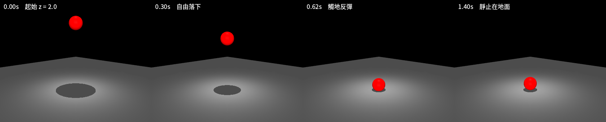

# 01｜MuJoCo 是什麼？導論與安裝

> 原文來源：[MuJoCo Documentation — Overview](https://mujoco.readthedocs.io/en/stable/overview.html)（stable，MuJoCo 3.x）
>
> 擷取日期：2026-09-09

## 學習目標

- 了解 MuJoCo 的定位與核心特色
- 理解 MJCF / mjSpec / mjModel / mjData 的關係
- 完成安裝並跑通第一個模擬程式

## 前置知識

- 基礎 Python
- 對剛體動力學有基本概念即可

## MuJoCo 簡介

**MuJoCo** 是 **Mu**lti-**Jo**int dynamics with **Co**ntact 的縮寫，是一個通用的物理引擎（physics engine），目標是促進機器人學、生物力學、繪圖與動畫、機器學習等需要「快速且精確模擬多關節結構與環境互動」的研究與開發。

它最初由 Roboti LLC 開發，2021 年 10 月由 Google DeepMind 收購並免費開放，2022 年 5 月開源，原始碼在 [google-deepmind/mujoco](https://github.com/google-deepmind/mujoco)。

MuJoCo 是以 C/C++ 撰寫、提供 C API 的函式庫。使用者以原生 **MJCF** 場景描述語言（一種盡量讓人容易閱讀與編輯的 XML 格式）定義模型，也可以直接載入 URDF 模型檔。函式庫內建以 OpenGL 渲染的互動式 GUI。

## 核心特色（譯註：以下為重點摘譯）

1. **廣義座標 + 現代接觸動力學**：傳統上機器人引擎使用廣義座標（generalized coordinates）但接觸處理不佳；遊戲引擎用最佳化方法處理接觸卻採用過度指定的卡氏座標。MuJoCo 首創將兩者結合。
2. **柔軟、凸、可解析求逆的接觸動力學**：接觸力不求解 NP-hard 的 LCP/NCP 互補問題，而是化為凸最佳化（convex optimization）問題。預設 Newton 求解器（solver）具有二次收斂速度。
3. **肌腱幾何（tendon geometry）**：可建模 3D 肌腱路徑，含繞繞（wrapping）與滑輪等機構。
4. **通用致動模型**：抽象化的致動器（actuator）模型可統一表示馬達、氣壓缸、PD 控制器、生物肌肉等。
5. **可重組的計算管線**：頂層步進函式為 `mj_step`，但管線各部分可透過旗標任意組合，也可直接呼叫底層函式與自訂 callback。
6. **模型與資料分離**：`mjModel` 存放編譯後的模型（恆定不變），`mjData` 存放所有動態狀態與中間結果。同一個 `mjModel` 可搭配多個 `mjData` 做多執行緒平行取樣。
7. **高效能**：初始化後執行期零記憶體配置；支援約束島嶼（constraint islands）平行化與島嶼休眠。
8. **互動式視覺化**：可即時渲染接觸點、接觸力、慣性盒等除錯資訊，還能「伸手進去」推動物體觀察物理反應。
9. **GPU 加速後端**：MJX（JAX）與 MuJoCo Warp（NVIDIA Warp），使用相同的 `mjModel`/`mjData` 結構。

## 模型的各種層級

MuJoCo 中「模型」有高低兩層、檔案與記憶體兩種載體：

| | 高層級 | 低層級 |
| --- | --- | --- |
| **檔案** | MJCF / URDF（XML）、MJZ（zip 封裝） | MJB（二進位） |
| **記憶體** | `mjSpec`（C struct） | `mjModel`（C struct） |

所有執行期計算都發生在 `mjModel` 上。取得 `mjModel` 的路徑：

- 文字編輯器 → MJCF/URDF 檔 →（解析器 → `mjSpec` → 編譯器）→ `mjModel`
- MJZ 封存 →（解碼 → `mjSpec` → 編譯）→ `mjModel`
- 程式碼 → `mjSpec` →（編譯）→ `mjModel`
- MJB 檔 →（載入器）→ `mjModel`

> 譯註：MJB 與版本綁定且無法反編譯，模型請一律以 XML（MJCF）或 MJZ 保存。

## 安裝

```bash
pip install mujoco
```

驗證版本：

```bash
python -c "import mujoco; print(mujoco.__version__)"
```

## 第一個範例

模型檔 `models/hello.xml`（一顆自由落下的球）：

```xml
<mujoco>
  <worldbody>
    <light pos="0 0 3"/>
    <geom type="plane" size="5 5 0.1"/>
    <body pos="0 0 2">
      <freejoint/>
      <geom type="sphere" size="0.2" rgba="1 0 0 1"/>
    </body>
  </worldbody>
</mujoco>
```

程式 `scripts/hello_mujoco.py`：

```python
import mujoco

model = mujoco.MjModel.from_xml_path("models/hello.xml")
data = mujoco.MjData(model)

for _ in range(200):  # 模擬 200 步（預設 timestep 0.002s → 0.4 秒）
    mujoco.mj_step(model, data)

print("球的高度 z =", data.qpos[2])
```

執行：

```bash
python scripts/hello_mujoco.py
```

預期會看到球的高度低於初始值 2.0，表示重力正在作用。

[](../assets/strip_hello_ball.png)

同一段模擬在四個時間點的畫面（`scripts/make_model_figures.py` 產生）。地板的陰影
會跟著球的高度變化 — 這是 MuJoCo 預設就有的 headlight 打出來的，模型裡只放了一盞燈。

> 測試環境：Linux、MuJoCo 3.13.0、Python 3.12.3；實測輸出 `球的高度 z = 1.211...`。

## 常見錯誤與除錯

- **`Error: could not open XML file`**：確認工作目錄是專案根目錄，路徑 `models/hello.xml` 才找得到。
- **模型載入錯誤**：MJCF 解析器會印出詳細的行號錯誤訊息，照訊息修正 XML 即可。

## 延伸閱讀

- [Overview — MuJoCo documentation](https://mujoco.readthedocs.io/en/stable/overview.html)
- [Programming 章節](https://mujoco.readthedocs.io/en/stable/programming/)
- [MuJoCo Menagerie 官方模型庫](https://github.com/google-deepmind/mujoco_menagerie)
