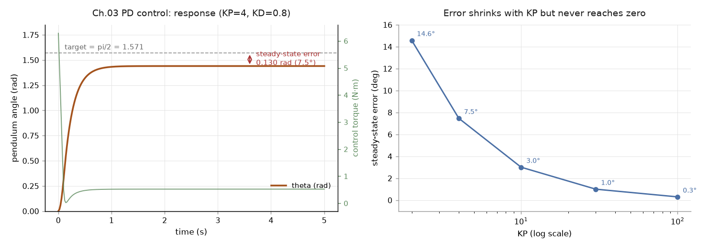

# 03｜程式設計入門：模擬迴圈、命名慣例與致動器控制

> 原文來源：[Programming — MuJoCo Documentation](https://mujoco.readthedocs.io/en/stable/programming/)（stable，MuJoCo 3.x）
>
> 擷取日期：2026-09-09

## 學習目標

- 理解 MuJoCo 的程式架構（Engine / Parser / Compiler / Rendering）
- 學會 API 命名慣例，看得懂官方 API Reference
- 掌握 `mjModel` / `mjData` 常用欄位
- 用 `data.ctrl` 對雙擺做 PD 控制

## 前置知識

- [02｜MJCF 建模基礎](../01-basics/01-mjcf-basics.md)

## 程式架構

MuJoCo 是跨平台（Windows / Linux / macOS）的動態函式庫，需要 CPU 支援 AVX 指令集。原始碼依功能分為：

| 模組 | 語言 | 職責 |
| --- | --- | --- |
| Engine | C | 物理引擎本體，所有執行期計算 |
| Parser | C++ | 解析 MJCF / URDF，產生內部物件（經 `mjSpec` 暴露給使用者） |
| Compiler | C++ | 把解析結果編譯成執行期使用的 `mjModel` |
| Thread | C++ | 執行緒池框架（`mju_threadpool`） |
| Rendering | C / C++ | 經典 OpenGL 渲染與較新的 Filament 渲染 |
| Abstract visualizer / UI | C | 抽象視覺化與 UI 框架 |

對 Python 使用者而言，`pip install mujoco` 的套件已包含全部功能；C/C++ 開發者可從 [GitHub Releases](https://github.com/google-deepmind/mujoco/releases) 下載預編譯函式庫，無需安裝其他相依套件。

## API 命名慣例

所有 API 符號以 `mj` 開頭，第二段字母決定家族：

**型別**

| 前綴 | 意義 | 範例 |
| --- | --- | --- |
| `mj` | 核心模擬資料結構（全大寫者為巨集） | `mjModel`、`mjMIN` |
| `mjt` | 基本型別（多為 enum） | `mjtNum`、`mjtGeom` |
| `mjf` | callback 函式型別 | `mjfGeneric` |
| `mjs` | 程序化建模（mjSpec） | `mjsJoint` |
| `mjv` / `mjr` / `mjui` | 視覺化 / OpenGL 渲染 / UI | `mjvCamera`、`mjrContext` |

**函式**（函式前綴必以底線結尾）

| 前綴 | 意義 | 範例 |
| --- | --- | --- |
| `mj_` | 核心模擬函式，前兩個參數通常是 `mjModel*`、`mjData*` | `mj_step` |
| `mju_` | 工具函式（不依賴 model/data） | `mju_mulMatVec` |
| `mjv_` / `mjr_` / `mjui_` | 視覺化 / 渲染 / UI | `mjv_updateScene` |
| `mjcb_` | 全域 callback 指標（可安裝自訂函式） | `mjcb_control` |
| `mjd_` | 導數計算 | `mjd_transitionFD` |
| `mjs_` | 程序化建模 | `mjs_addJoint` |

> 譯註：Python 綁定與 C API 一一對應，例如 C 的 `mj_step(m, d)` 就是 Python 的 `mujoco.mj_step(model, data)`。

## mjData 常用欄位

`mjModel` 是編譯後的模型（唯讀）；`mjData` 是狀態與工作區。最常用欄位：

| 欄位 | 意義 | 維度 |
| --- | --- | --- |
| `time` | 目前模擬時間 | 純量 |
| `qpos` | 廣義座標位置 | `nq` |
| `qvel` | 廣義速度 | `nv` |
| `qacc` | 廣義加速度（最近一次 `mj_step` 算出） | `nv` |
| `ctrl` | 致動器控制輸入（你的控制器寫這裡） | `nu` |
| `actuator_force` | 致動器實際輸出的力 | `nu` |
| `sensordata` | 感測器讀值 | `nsensordata` |
| `xpos` / `xquat` | 各 body 的世界座標位置 / 姿態 | `nbody` |

典型模擬迴圈：

```python
while data.time < T:
    data.ctrl[:] = my_controller(model, data)  # 讀狀態、寫控制
    mujoco.mj_step(model, data)                 # 推進一個 timestep
```

## 完整範例：用 PD 控制器穩定單擺

在單擺上加一個 `<motor>`，用 PD 控制把它穩在水平位置。

`models/pendulum_actuated.xml`：

```xml
<mujoco>
  <worldbody>
    <light pos="0 -1 2"/>
    <body name="pendulum" pos="0 0 1">
      <joint name="hinge" type="hinge" axis="0 1 0" damping="0.05"/>
      <geom type="capsule" fromto="0 0 0 0 0 -0.4" size="0.02" rgba="0.2 0.4 0.9 1"/>
      <site name="tip" pos="0 0 -0.4" size="0.02" rgba="1 1 0 1"/>
    </body>
  </worldbody>

  <actuator>
    <motor name="motor" joint="hinge" gear="2" ctrllimited="true" ctrlrange="-1 1"/>
  </actuator>

  <sensor>
    <jointpos joint="hinge"/>
    <jointvel joint="hinge"/>
  </sensor>
</mujoco>
```

重點：

- `<motor>` 掛在 `hinge` 上，`gear` 是增益（控制量 × gear = 力矩）。
- `ctrllimited` + `ctrlrange` 限制控制輸入範圍。
- `<sensor>` 宣告後，讀值會出現在 `data.sensordata`。

`scripts/pd_control.py`：

```python
import mujoco
import numpy as np

model = mujoco.MjModel.from_xml_path("models/pendulum_actuated.xml")
data = mujoco.MjData(model)

TARGET = np.pi / 2   # 目標：水平（垂下為 0）
KP, KD = 4.0, 0.8    # PD 增益

while data.time < 5.0:
    theta = data.qpos[0]
    omega = data.qvel[0]
    data.ctrl[0] = KP * (TARGET - theta) - KD * omega
    mujoco.mj_step(model, data)

print("最終角度 theta =", round(data.qpos[0], 3), "rad（目標", round(TARGET, 3), "）")
print("最終角速度     =", round(data.qvel[0], 3))
print("感測器讀值     =", np.round(data.sensordata, 3))
```

執行：

```bash
python scripts/pd_control.py
```

單擺從垂下位置被 PD 控制器拉起並穩在水平附近。

[](../../runs/pd_control.png)

左圖：角度在 1 秒內收斂，但停在 1.440 而不是目標的 1.571 — 差 0.130 rad（7.5°）。
綠線（右軸）是控制力矩，穩態時停在約 0.5 N·m，那正是撐住重力所需的力矩：
**PD 控制器要靠「誤差」才產生力矩，所以誤差不可能歸零**。

右圖：把 KP 從 2 掃到 100，穩態誤差從 14.6° 降到 0.3°，單調變小但永遠不到 0。
要真正消除它得加積分項（PID）或重力前饋補償。資料在
[runs/pd_control_log.csv](../../runs/pd_control_log.csv)、
[runs/pd_kp_sweep.csv](../../runs/pd_kp_sweep.csv)。

> 譯註：實測最終角度約 1.44 rad 而非目標的 1.571 rad — 這是純 PD 控制沒有重力補償的正常現象（穩態誤差），剛好可以用來討論為什麼需要積分項或前饋補償。
>
> 測試環境：Linux、MuJoCo 3.12.0、Python 3.12.3；實測輸出 `theta = 1.44 rad`、角速度 `0.0`。

> 譯註：更進階的做法是把控制器裝進 `mjcb_control` callback，讓 `mj_step` 內部自動呼叫；直接寫在迴圈裡效果相同且較直覺。

## 常見錯誤與除錯

- **`ctrl` 沒反應**：檢查模型是否真的有 actuator（`model.nu > 0`）；`ctrlrange` 是否把輸出限制掉了。
- **`qpos` 維度和 `qvel` 不同**：`freejoint` 的位置是 7 維（3 位置 + 4 四元數），速度是 6 維 — 即 `nq ≠ nv`。
- **模擬爆炸（NaN）**：通常先檢查 PD 增益過大、或 timestep 對系統剛性而言太粗。
- **版本檢查**：C 開發者可用 `mjVERSION_HEADER != mj_version()` 確認標頭與函式庫版本一致。

## 延伸閱讀

- [Programming — MuJoCo Documentation](https://mujoco.readthedocs.io/en/stable/programming/)
- [API Reference](https://mujoco.readthedocs.io/en/stable/APIreference/)
- [Python 綁定文件](https://mujoco.readthedocs.io/en/stable/python.html)
