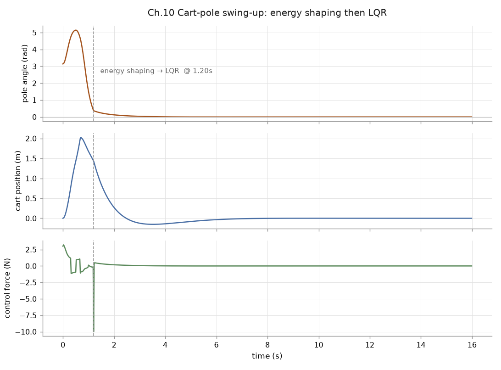

# 10｜進階任務：車桿 Swing-up（能量整形 + LQR）

> 參考來源：[mjd_transitionFD — MuJoCo API Reference](https://mujoco.readthedocs.io/en/stable/APIreference/)、Åström & Furuta, *Swinging up a pendulum by energy control* (Automatica, 2000)
>
> 擷取日期：2026-09-09
>
> 相依套件：`pip install scipy`（LQR 解 Riccati 方程用）
>
> 測試環境：Linux、MuJoCo 3.12.0、Python 3.12.3；已實測成功。

## 學習目標

- 用經典控制（非 RL）解車桿 swing-up：能量整形盪起 + LQR 穩定
- 學會用 `mjd_transitionFD` 對系統做數值線性化
- 理解「盪起」與「穩定」為什麼要分兩段處理

## 前置知識

- [03｜程式設計入門](01-simulation-loop.md)、基礎線性控制（LQR 概念即可）

## 為什麼這個任務值得學？

車桿（cart-pole）swing-up 是欠驅動控制的教科書任務：桿自由下垂、只能靠推車子把桿「盪」上去，到頂附近再穩住。它同時示範了：

1. **非線性全局控制**（能量整形）— RL 之外的正統做法；
2. **局部線性控制**（LQR）— 搭配 MuJoCo 的數值微分 API，不必手推線性化。

## 模型

`models/cartpole_swingup.xml`：滑軌上的車（slide joint，行程 ±2 m）+ 車上的桿（hinge，向上為 θ=0），馬達只推車（`gear=30`、`ctrlrange=±10`）。桿從 θ=π（垂下）出發。

## 控制器設計（`scripts/ex_cartpole_swingup.py`）

### 階段一：Åström 能量整形

桿的總能量 E（動能 + 位能，以垂下為零點），目標是把 E 推到直立位能 E₀ = 2·m·g·l。控制律：

```
u = k · (E - E₀) · sign(ω · cosθ)
```

直覺：在「能增加能量」的方向推車。E < E₀ 時持續注入能量，桿越盪越高。

### 階段二：數值線性化 + LQR

進入直立鄰域（|θ| < 0.4 rad）後切換。線性化不用手推公式，直接問 MuJoCo：

```python
data.qpos[:] = [0, 0]            # 直立平衡點
mujoco.mj_forward(model, data)
mujoco.mjd_transitionFD(model, data, 1e-6, True, A_d, B_d, None, None)
```

> ⚠️ **關鍵細節**：`mjd_transitionFD` 回傳的是**離散時間** Jacobian（含一個 timestep 的演化），不是連續時間的 Ẋ=AX+BU。要轉換：`A_c = (A_d - I)/dt`、`B_c = B_d/dt`，再解連續 Riccati 方程。本章開發時第一版忘了轉換，算出來的 K 是天文數字（10⁹ 等級）— 看到不合理的增益先懷疑這裡。

```python
P = solve_continuous_are(A_c, B_c, Q, R)   # scipy
K = np.linalg.solve(R, B_c.T @ P)[0]
# 控制：u = -K · [x, θ, ẋ, θ̇]
```

## 實測結果

```
LQR 增益 K = [ -3.16 -51.65  -6.5  -12.42]
swing-up 時刻: 1.19 s
最終狀態: x = -0.000 m, θ = 0.000 rad（應都接近 0）
runs/cartpole_log.csv 已寫出（800 列）
結果: 成功直立並穩定 ✓
```

1.19 秒盪起，之後 LQR 把車和桿都穩定到原點。

[](../../runs/cartpole_traj.png)

三張圖共用同一條時間軸，虛線是控制器切換的時刻（圖上標 1.20 s 是 50 Hz 取樣裡最接近
的那一筆，實際切換在 1.19 s）。三件事在圖上看得很清楚：

- **桿角**從 π（垂下）盪過 5.1 rad 再收到 0。這個角度沒有 wrap 到 [-π, π]，所以「繞過去」
  在圖上是連續上升而不是跳變。
- **台車位置**先衝到 2.0 m —— 能量整形不管台車跑多遠，它只負責把能量灌進系統。要限制行程
  得另外加約束。
- **控制力**在切換瞬間打到 -10 N 的限幅：LQR 接手時桿還在動，要一個大的反向力才煞得住。
  之後就幾乎是零，因為系統已經在平衡點附近。

資料：[runs/cartpole_log.csv](../../runs/cartpole_log.csv)。

## 常見錯誤與除錯

- **K 值大到離譜**：`mjd_transitionFD` 的輸出忘了除以 `dt` 轉成連續時間（見上）。
- **能量法盪不起來**：檢查能量零點的定義是否與 E₀ 一致；本章就踩過「位能慣性系差一個常數」的坑（E₀ 應為 2mgl 而非 mgl）。
- **切換時機**：切換閾值（|θ|<0.4）要在 LQR 的吸引域內；太小會永遠切不過去，太大 LQR 接不住。
- **撞軌道盡頭**：slide joint 的 `range` 會把車卡住，Q 矩陣對 x 的權重不能太小。

## 延伸閱讀

- Åström & Furuta (2000) — 能量控制 swing-up 原始論文
- [Derivatives — mjd_transitionFD](https://mujoco.readthedocs.io/en/stable/APIreference/)
- 下一步：acrobot / 雙擺 swing-up 需要 partial feedback linearization，能量整形的符號與吸引域設計都更挑剔 — 這也是本章從雙擺改成車桿的原因（誠實標註：雙擺版本的手調能量控制器在本專案實測失敗，未收錄）
