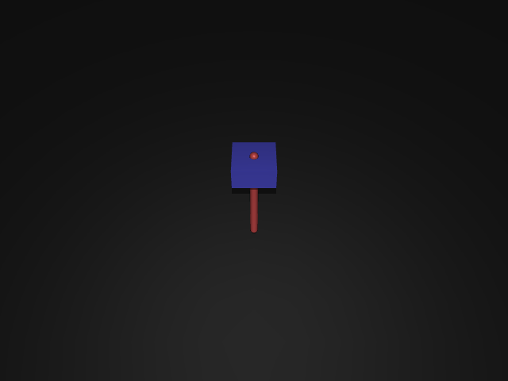
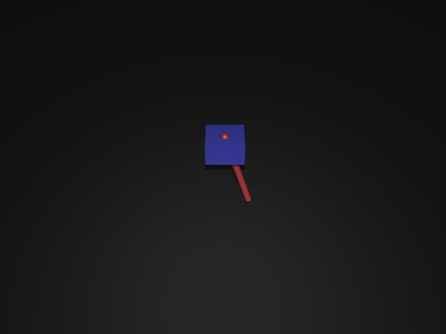
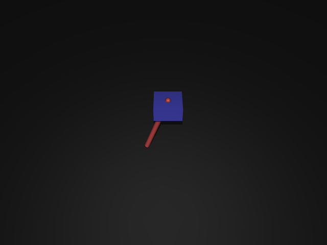
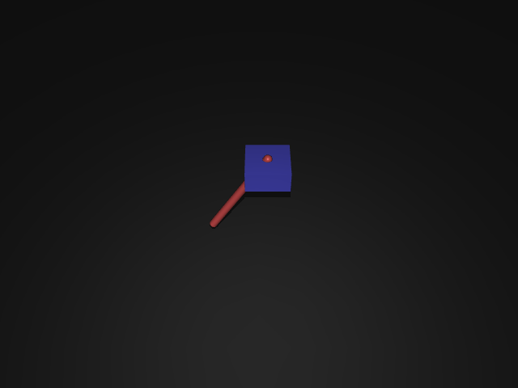

# 11｜視覺化：互動式 Viewer 與離屏渲染

> 參考來源：[Python bindings — mujoco.viewer / Renderer](https://mujoco.readthedocs.io/en/stable/python.html)（stable，MuJoCo 3.x）
>
> 擷取日期：2026-09-09
>
> 測試環境：Linux、MuJoCo 3.12.0（無顯示器，離屏渲染用 `MUJOCO_GL=osmesa` 實測）

## 學習目標

- 用互動式 viewer 即時觀察與除錯模擬
- 在無顯示器環境用 `mujoco.Renderer` 離屏渲染，輸出圖片/影片或當視覺觀測

## 前置知識

- [01｜導論與安裝](../00-intro/01-what-is-mujoco.md)

## 方式一：互動式 Viewer（需要顯示器）

最快的除錯工具 — 可以直接用滑鼠推拉物體、即時看物理反應：

```bash
python -m mujoco.viewer --mjcf=models/cartpole_swingup.xml
```

程式內使用（邊跑控制器邊看）：

```python
import mujoco.viewer
import time

model = mujoco.MjModel.from_xml_path("models/cartpole_swingup.xml")
data = mujoco.MjData(model)

with mujoco.viewer.launch_passive(model, data) as viewer:
    while viewer.is_running():
        mujoco.mj_step(model, data)     # 控制器寫 data.ctrl 也在這裡
        viewer.sync()                   # 把最新狀態送到畫面
        time.sleep(model.opt.timestep)  # 即時播放
```

`launch_passive` 的設計重點：**viewer 不擁有模擬**，你的迴圈照樣控制 `mj_step` 與 `ctrl`，viewer 只是被動顯示 — 所以除錯控制器時行為與無頭模式完全一致。

## 方式二：離屏渲染（無顯示器 / 伺服器）

`mujoco.Renderer` 把場景渲染成 numpy 陣列，用途：存圖、剪影片、CNN 視覺觀測。範例
`scripts/ex_viewer.py` 每 0.2 秒抓一張車桿自由擺盪的影格：

```python
renderer = mujoco.Renderer(model, height=480, width=640)
renderer.update_scene(data)             # 捕捉當前狀態
img = renderer.render().copy()          # (H, W, 3) uint8
```

`render()` 回傳的是 renderer 內部的緩衝區，收集連續影格時要 `.copy()`，否則清單裡每個
元素都指向同一張畫面（[22 章](../06-amr/10-yreach-mission.md) 錄影時踩過這個坑）。

實測輸出（t = 0、0.2、0.4、0.6 秒）：

| | |
| --- | --- |
|  |  |
|  |  |

初始角度要避開平衡點：桿正好放在 `qpos[1] = π`（垂下）時是穩定平衡，沒有控制輸入的話
四張影格會一模一樣。範例從偏離 0.6 rad 出發，靠重力自然擺盪。

### 無顯示器環境的 GL 後端

MuJoCo 的渲染需要 OpenGL context。伺服器上沒有顯示器時，用環境變數選後端：

| `MUJOCO_GL` | 適用 |
| --- | --- |
| `osmesa` | 純 CPU 軟體渲染（本機實測用這個），需系統有 osmesa 函式庫 |
| `egl` | 有 NVIDIA GPU 的伺服器，硬體加速離屏渲染 |
| `glfw` | 有顯示器的桌面（預設） |

```bash
MUJOCO_GL=osmesa python scripts/ex_viewer.py
```

### 自訂相機與視覺旗標

```python
cam = mujoco.MjvCamera()
cam.azimuth, cam.elevation, cam.distance = 45, -20, 3.0
renderer.update_scene(data, camera=cam)

# 疊加除錯資訊：接觸點、座標系等
renderer.scene.flags[mujoco.mjtRndFlag.mjRND_CONTACTPOINT] = True
```

## 常見錯誤與除錯

- **`GLFWError: X11: Failed to open display`**：無顯示器環境忘了設 `MUJOCO_GL=osmesa` 或 `egl`。
- **畫面全黑**：模型沒有 `<light>` — MuJoCo 不做全域光照，沒燈就是黑的（本章範例圖片第一次渲染就是這樣，補了 `<light>` 與地板才正常）。
- **`viewer.sync()` 畫面不動**：`sync()` 要在 `mj_step` 之後呼叫；且互動迴圈裡別忘了 `time.sleep`，否則播放速度會遠快於即時。
- **渲染耗時**：Renderer 建立有成本，迴圈內不要每步都 `mujoco.Renderer(...)`，建立一次重複用。

## 延伸閱讀

- [Python 綁定：viewer 與 Renderer](https://mujoco.readthedocs.io/en/stable/python.html)
- 官方教學 notebook（Colab）大量使用 Renderer 產生動畫
