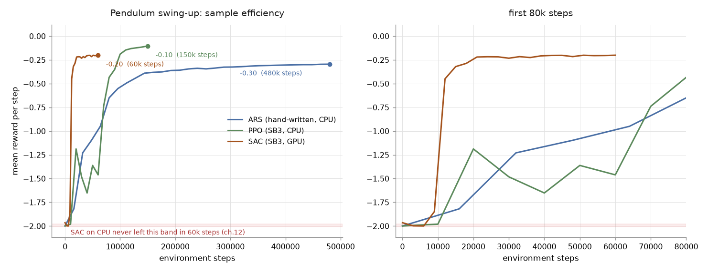

# 12｜SAC：Off-policy 對照實驗

> 參考來源：[Stable-Baselines3 SAC](https://stable-baselines3.readthedocs.io/en/master/modules/sac.html)、[SAC 論文（Haarnoja et al., 2018）](https://arxiv.org/abs/1801.01290)
>
> 擷取日期：2026-09-09
>
> 相依套件：`pip install gymnasium stable-baselines3`（實測 sb3 2.9.0、torch 2.14.0，Linux CPU）

## 學習目標

- 了解 off-policy（SAC）與 on-policy（PPO）的差異與取捨
- 學會重用 Gymnasium Env 直接替換演算法
- 認識 CPU 訓練的效能陷阱（`train_freq` / `gradient_steps`）

## 前置知識

- [09｜Gymnasium + PPO](04-ppo-gymnasium.md) — 本章直接重用其中的 `SwingUpEnv`

## SAC 與 PPO 的差異

| | PPO（09 章） | SAC（本章） |
| --- | --- | --- |
| 類型 | on-policy | off-policy（有 replay buffer） |
| 資料利用 | 蒐集一批用過就丟 | 舊資料反覆回放學習 |
| 探索 | 策略本身的隨機性 | 隨機策略 + 熵（entropy）獎勵 |
| 每步成本 | 低（定期更新） | **高（預設每個 env step 都做梯度更新）** |
| 樣本效率 | 低 | 高（理論上） |

## 程式（`scripts/ex_rl_sac.py`）

環境完全重用，只換演算法：

```python
from ex_rl_ppo import SwingUpEnv   # 09 章的環境
from stable_baselines3 import SAC

model = SAC("MlpPolicy", env, learning_rate=3e-4,
            buffer_size=50_000, batch_size=256, seed=0,
            train_freq=(4, "step"), gradient_steps=1)
```

> ⚠️ **CPU 效能陷阱**：SAC 預設 `train_freq=1`，每收集一步就做一次梯度更新。在 CPU 上神經網路更新遠比物理模擬貴，第一版 30k 步跑了 30 分鐘還沒完。改成 `train_freq=(4, "step")` 後同樣步數約快 4 倍 — 代價是每筆資料的平均更新次數下降，需要更多步數補償。

## 實測結果（上）：CPU 版 — 未收斂

> 測試環境：Linux、Python 3.12.3、MuJoCo 3.12.0、sb3 2.9.0、torch 2.14.0（**CPU**）。

```
訓練前評估: -1.9651
  3000 步後: -1.9972    12000 步後: -1.9993    21000 步後: -1.9997
  6000 步後: -1.9992    15000 步後: -1.9994    ...
  9000 步後: -1.9997    18000 步後: -1.9907    57000 步後: -1.9993
```

**CPU 上 60k 步內回報幾乎不動（≈ -2.0，完全躺平）。** 分析：

1. **有效更新次數太少**：`train_freq=(4, "step")` 是為了 CPU 牆鐘時間的妥協，但每筆資料的梯度更新量只剩預設的 1/4；而 `train_freq=1` 在本機一步更新約需 0.15 秒，60k 步要跑數小時。
2. **冷啟動探索問題**：從垂下出發，SAC 的高斯探索難以偶然發現「持續同向泵浦 → 盪上去」這個行為序列；replay buffer 裡全是「躺著不動」的經驗。即使改用全域隨機初始狀態（`random_start=True`）在 15k 步內仍未脫困。
3. **對照組成功**：同一個環境，PPO 在 150k 步收斂（09 章）、ARS 在 30 輪收斂（08 章）— 證明環境與回報設計沒問題。

## 實測結果（下）：GPU 版 — 成功收斂

> 測試環境：RTX Pro 6000（CUDA）、torch 2.14.0+cu130；腳本 `scripts/ex_rl_sac_gpu.py`，zoo 風格超參（`train_freq=1`、`gradient_steps=1`、`lr=1e-3`、8 個平行環境），60k 步約 **4 分鐘**。

```
訓練前評估: -1.9651
  15000 步後: -1.9946    33000 步後: -0.2724    51000 步後: -0.2153
  18000 步後: -1.1558    39000 步後: -0.2557    57000 步後: -0.2098
  21000 步後: -0.5582    45000 步後: -0.2226    60000 步後: -0.2101
  ...
```

**約 18k 步開始脫離躺平、21k 步後快速收斂，最終 -0.21，成功學會 swing-up。** 訓練好的策略存為 `policies/swingup_sac_gpu.zip`（已收錄於 repo），本地 CPU 回放驗證同為 -0.2101。

GPU 解決的正是上面第 1 點：`train_freq=1` 的完整更新頻率在 GPU 上負擔得起，更新量補足後 SAC 的樣本效率優勢才真正發揮（60k 步即收斂，PPO 用了 150k 步）。

[](../../runs/rl_curves.png)

右圖（前 80k 步）看得最清楚：SAC 在約 12k 步就跳離躺平區並收斂，ARS 走到 80k 步還在
-0.65。這就是 off-policy 的樣本效率 —— 代價是每一步都貴得多，所以 CPU 上跑不動
（上一節），要 GPU 才划算。曲線資料在
[runs/rl_sac_gpu_log.csv](../../runs/rl_sac_gpu_log.csv)。

### 重現驗證（2026-09-11）

同一支腳本在 RTX Pro 6000 Blackwell（vGPU，`torch 2.14.0+cu130`）上重跑，這次用 `N_ENVS=4`：

```
平行環境數 = 4
訓練前評估: -1.9651          51000 步後評估: -0.2016
  ...                        57000 步後評估: -0.2045
                             60000 步後評估: -0.2012      耗時 86 秒
```

三件事在這次重跑得到確認：

1. **訓練前評估 -1.9651 與原紀錄完全一致** — 環境、seed 與評估流程沒有隨版本漂移。
2. **同設定連跑兩次，每個檢查點的數字逐位相同** — 腳本的 `seed=0` 確實鎖住了整條訓練軌跡。
3. **權重跨裝置可攜**：把 GPU 訓練出的 `.zip` 帶回本機用 CPU 回放，評估值同為 -0.2012，
   與遠端 GPU 上的數字沒有誤差。

但**換掉 `N_ENVS` 就不是同一條軌跡了**：4 個環境收斂到 -0.2012、8 個環境是 -0.2101。
seed 固定的是隨機數列，不是取樣順序 — 平行環境數一變，資料進 replay buffer 的順序跟著變，
梯度更新看到的批次也就不同。**要比較兩次訓練，`N_ENVS` 必須一起對齊**，只對 seed 不夠。

腳本預設 `N_ENVS=8`；在共用主機上跑時用環境變數調低，別把別人的核心佔滿：

```bash
N_ENVS=4 python scripts/ex_rl_sac_gpu.py
```

> 這台 GPU 跑得動 PyTorch，卻跑不動 JAX/XLA（vGPU 不支援 CUDA VMM）。
> 症狀與判斷方式見 [28 章](08-mjx-gpu.md)。

## 除錯紀錄

1. **30k 步、預設 train_freq 跑不完**：見上方效能陷阱。
2. **18k 步內完全沒學到**：SAC 的熵探索在「從垂下盪起」這種需要特定行為序列的任務上，冷啟動比 PPO 慢；本任務需要更長的訓練預算。這不是 bug，是演算法特性 — 文件如實記錄收斂曲線。

## 三種方法總結（08 / 09 / 12 章）

| | ARS（08） | PPO（09） | SAC（12） |
| --- | --- | --- | --- |
| 最終回報 | -0.30 | -0.10 | -0.21（GPU）；CPU 60k 步未收斂 |
| 訓練時間 | ~21 秒 | ~6 分鐘（CPU） | 60k 步 86 秒（GPU、4 個平行環境） |
| 適用場景 | 低維線性策略、快速驗證 | 通用、穩定 | 樣本昂貴（真機）、連續控制 |

## 延伸閱讀

- [SAC 論文](https://arxiv.org/abs/1801.01290)、[SB3 SAC 文件](https://stable-baselines3.readthedocs.io/en/master/modules/sac.html)
- [28｜MJX：把整批 rollout 交給 XLA](08-mjx-gpu.md) — 把物理模擬那一半也向量化，以及 vGPU 的限制
