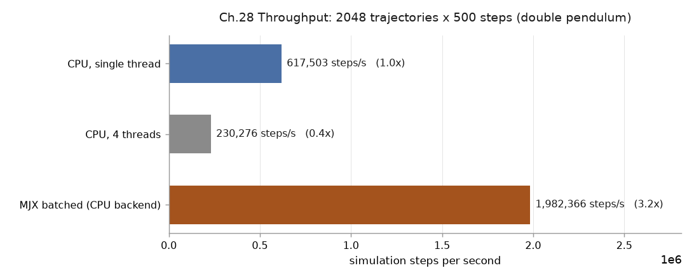

# 28｜MJX：把整批 rollout 交給 XLA（以及 vGPU 上的限制）

> 參考來源：[MJX 官方文件](https://mujoco.readthedocs.io/en/stable/mjx.html)、[JAX 文件](https://docs.jax.dev/en/latest/)
>
> 擷取日期：2026-09-11
>
> 測試環境：遠端主機 8 核 CPU、NVIDIA RTX Pro 6000 Blackwell DC-96Q（**vGPU**）、
> Python 3.12、jax 0.11.1、torch 2.14.0+cu130
>
> 這一整章的數字都是在**遠端主機**上量的，MuJoCo 3.12.0 —— 那台的版本組合不跟著本機的
> [requirements.txt](../../requirements.txt) 升，因為 jax plugin 綁著這個 MuJoCo 版本。
>
> 相依套件：`pip install mujoco-mjx jax`（GPU 另需對應 CUDA 版本的 jax plugin）

## 學習目標

- 了解 MJX 用什麼機制把 rollout 變成批次運算，以及它和多執行緒的差別在哪
- 會量「單執行緒 / 多執行緒 / MJX 批次」三種做法的吞吐，並讀懂數字代表什麼
- 認得 vGPU 環境讓 JAX/XLA 起不來的症狀，知道怎麼判斷與怎麼繞

## 前置知識

- [07｜更多 Python 範例](02-more-examples.md) — 多執行緒平行取樣與 GIL 的討論
- [12｜SAC：Off-policy 對照實驗](07-sac.md) — GPU 訓練的另一半（神經網路更新）

## MJX 與 `mj_step` 的差別在資料佈局

MJX 是 MuJoCo 物理的 JAX 實作。它和 C 版的差別不在演算法，在**一次處理幾個狀態**：

| | C / Python 版 | MJX |
| --- | --- | --- |
| 一次推進 | 一個 `mjData` | 一批狀態（第 0 維是批次） |
| 迴圈在哪 | Python 的 `for` | `jax.lax.scan`，編譯進 kernel |
| 平行度來源 | 執行緒（受 GIL 限制） | 批次維度的向量化 |
| 執行方式 | 直譯逐步呼叫 | XLA 編譯成一個 kernel |

差別的實際效果是：Python 版每一步都要回到直譯器一次，MJX 把「500 步 × 2048 條」整段編譯成單一運算，
中途不回 Python。

`scripts/ex_mjx_throughput.py` 的核心是兩層包裝：

```python
@jax.jit
def rollout(qpos):
    dx = mjx.make_data(mx).replace(qpos=qpos)
    dx, _ = jax.lax.scan(lambda d, _: (mjx.step(mx, d), None), dx, None, length=steps)
    return dx.qpos

batched = jax.jit(jax.vmap(rollout))   # 再把批次維度加上去
```

`lax.scan` 收掉時間維度，`vmap` 收掉批次維度。兩者都是編譯期就決定好的形狀 —— 這也是限制：
**批次大小或步數一變就要重編譯**。

計時要跑第二次。第一次呼叫包含 JIT 編譯，拿它算吞吐會把編譯時間算進去，數字會難看得莫名其妙：

```python
out = batched(qpos0); out.block_until_ready()   # 第一次：含編譯，丟掉
t0 = time.perf_counter()
out = batched(qpos0); out.block_until_ready()   # 第二次：穩態吞吐
```

`block_until_ready()` 不能省。JAX 的呼叫是非同步的，少了它量到的是「發出指令」的時間，不是算完的時間。

## 吞吐對照

雙擺（`models/double_pendulum.xml`，nq=2），2048 條軌跡 × 每條 500 步 = 102.4 萬個 step，三種做法各跑完整批次：

| 做法 | 耗時 | 步數／秒 | 相對 |
| --- | ---: | ---: | ---: |
| CPU 單執行緒 | 1.66 s | 617,503 | 1.0× |
| CPU 4 執行緒 | 4.45 s | 230,276 | 0.4× |
| MJX 批次（**CPU 後端**） | 0.52 s | 1,982,366 | 3.2× |

[](../../runs/mjx_throughput.png)

幾件事值得注意：

**多執行緒比單執行緒還慢**（0.4×，慢了一倍半）。`mj_step` 執行期間會釋放 GIL，但每一步前後的
Python 開銷不會，雙擺又小到單步成本幾乎全在 Python 那一側，於是執行緒切換的代價蓋過平行的好處。
這與 [08 章](03-rl-swingup.md)「多執行緒沒有加速」的結論同向；倍率不同是因為模型、批次規模與
執行緒數都不同，[REPORT](../../REPORT.md) 另一組規模量到 0.33×。要平行取樣就用行程
（[09 章](04-ppo-gymnasium.md)的 `SubprocVecEnv`）或 MJX，不要用執行緒。

順帶一提，**同一組測試在忙碌的機器上會低估 GIL 的損害**。這台 load average 約 5 時量到的是
0.7×，閒下來（load 0.4）之後變成 0.4× — 不是多執行緒變慢了，是單執行緒的基準線終於跑得出全速。
比值裡的分母被拖慢時，分子的問題看起來就沒那麼嚴重。**量相對效能要在乾淨的機器上量**，
不然結論會偏向「沒那麼糟」。

**MJX 那 3.2 倍不是 GPU 給的**。這台的 JAX 只跑得起 CPU 後端（原因見下一節），所以這 3.2 倍
純粹來自 XLA 把整段 rollout 編成一個 kernel、消掉每步回 Python 的開銷。GPU 後端能再快多少，
這台量不到 —— 本章不做那個宣稱。

> 量測條件：8 核主機、量測期間 load average 0.39（其他人的工作都結束了），三種做法在同一時段
> 連續跑。同樣的量測連跑兩次，三列的差異都在 3% 以內（單執行緒 617,503 / 617,783、
> MJX 1,982,366 / 1,988,090）。要自己重跑：
> `WORKERS=4 python scripts/ex_mjx_throughput.py 2048 500`（腳本會印出當下的 load average，
> 數字偏離太多時先看那一行）。

## 兩種 MJX 實作：JAX 與 Warp

MJX 現在有兩套後端實作，`mjx.put_model()` / `mjx.make_data()` 的 `impl` 參數決定用哪一套
（查證日期 2026-09-11）：

| | MJX-JAX（預設） | MJX-Warp（`impl='warp'`） |
| --- | --- | --- |
| 底層 | 純 JAX | [MuJoCo Warp](https://github.com/google-deepmind/mujoco_warp) |
| 自動微分 | 支援 | **不支援**，官方也沒有計畫支援 |
| 功能覆蓋 | joint 限 `FREE`/`BALL`/`SLIDE`/`HINGE`；`ELLIPSOID`、`CYLINDER` 只與基本形狀碰撞；`BOX` 以 mesh 實作 | 官方描述為最完整 |
| 接觸與約束效能 | JAX 版的瓶頸所在 | 針對這一塊改善 |

選擇的分界很清楚：**要對模擬做微分（可微分模擬、梯度式軌跡最佳化）只能用 JAX 版；
單純要吞吐、模型又用到 JAX 版不支援的功能，就走 Warp 版。**
本章的腳本沒指定 `impl`，走預設的 JAX 版；執行時看到的
`Failed to import warp: No module named 'warp'` 是 Warp 版未安裝的提示，不影響 JAX 版運作。

不支援的功能**不會靜默降級**：`mjx.put_model()` 遇到用了不支援特性的 `mjModel` 會直接丟例外。
這是好事 — 總比拿到一個安靜地算錯的模型好。

## 這張卡跑不了 JAX：vGPU 不支援 CUDA VMM

`nvidia-smi` 看得到卡、PyTorch 也用得動，JAX 卻找不到裝置：

```
E0911 00:16:18 platform_util.cc:279] Failed to create stream executor for device CUDA:0:
  Device 0 does not support CUDA Virtual Memory Management (VMM).
  VMM is required for device memory allocation in XLA.
RuntimeError: Unable to initialize backend 'cuda':
  INTERNAL: no supported devices found for platform CUDA
```

這台的 GPU 是虛擬化切出來的：

```
Product Name        : NVIDIA RTX Pro 6000 Blackwell DC-96Q
Virtualization Mode : VGPU
vGPU 授權產品        : NVIDIA RTX Virtual Workstation
```

型號尾巴的 `-96Q` 是 vGPU profile 而不是實體卡型號 —— 看到這種尾綴就可以先假設是虛擬化環境。

**同一張卡上 PyTorch 完全正常**：`torch.cuda.is_available()` 為 `True`、
compute capability 回報 `(12, 0)`、4096×4096 矩陣乘法跑得出結果，
[12 章](07-sac.md) 的 SAC 就是在這張卡上訓練的。

差別在記憶體配置方式。XLA 的裝置記憶體配置器要求 CUDA 的虛擬記憶體管理（VMM）API，
而這個 vGPU profile 沒有暴露它；PyTorch 的 caching allocator 不需要，所以不受影響。
這不是版本問題 —— 換 jax 版本、換 CUDA 版本都不會改變結果。

判斷流程：

1. `nvidia-smi -q | grep -i "Virtualization Mode"` — 出現 `VGPU` 就要有心理準備
2. `python -c "import jax; print(jax.devices())"` — 看它列出什麼後端
3. 錯誤訊息裡有 `VMM` 字樣 → 是環境限制，不是安裝錯誤

能做的選擇：

- **降級到 CPU 後端**：`JAX_PLATFORMS=cpu`。仍能拿到向量化的效益（上表那 3 倍），但沒有 GPU 加速。
- **換工具鏈**：PyTorch 系的 RL 訓練不受影響（12 章）；物理模擬留在 CPU、神經網路更新放 GPU，
  這個分工在中小模型上本來就常見。
- **換非虛擬化的實體 GPU**：要 MJX 的 GPU 吞吐只有這條路。

## 常見錯誤與除錯

- **只接 `ImportError` 會讓整支腳本崩掉**。「MJX 裝了但 GPU 後端起不來」丟的是 `RuntimeError`，
  而且是在 `mjx.put_model()` 內部呼叫 `jax.devices()` 時才丟。對照組跳過一列跟整支跑不完，
  差別在例外類型有沒有接對。
- **`jax[cuda12]` 不支援 Blackwell**（compute capability 12.0），要裝 `jax[cuda13]`。
  但兩個 plugin 同時存在會撞 `ALREADY_EXISTS: PJRT_Api ...`，換版時要先移除舊的。
  這台換完之後仍然失敗，因為真正的阻礙是上一節的 VMM，不是 plugin 版本 ——
  **一個症狀可能同時有好幾個獨立成因，修掉第一個不代表就通了**。
- **拿第一次呼叫計時**：含 JIT 編譯，量到的是編譯時間。
- **少了 `block_until_ready()`**：JAX 非同步執行，量到的是發指令的時間。
- **抽樣一小批再外推**：`double_pendulum` 這種小模型全量跑完只要幾秒，外推等於在結論裡
  摻進一個沒必要的誤差來源。能全量就全量。
- **MJX 與 C 版行為不完全等價**。官方 feature parity 表列出哪些功能在哪個實作可用（見上一節）。
  用到不支援的特性時 `put_model()` 會丟例外，不會安靜地算錯；但**能載入不等於數值一致** —
  `BOX` 在 JAX 版是以 mesh 實作的，接觸行為與 C 版不會逐位相同。要把 MJX 訓練的策略放回 C 版
  執行，得自己驗過差異範圍。

## 延伸閱讀

- [MJX 官方文件](https://mujoco.readthedocs.io/en/stable/mjx.html) — 含 feature parity 表與效能建議
- [MuJoCo Warp](https://github.com/google-deepmind/mujoco_warp) — MJX-Warp 的底層實作
- [12｜SAC：Off-policy 對照實驗](07-sac.md) — 同一張 GPU 上跑得動的另一半
