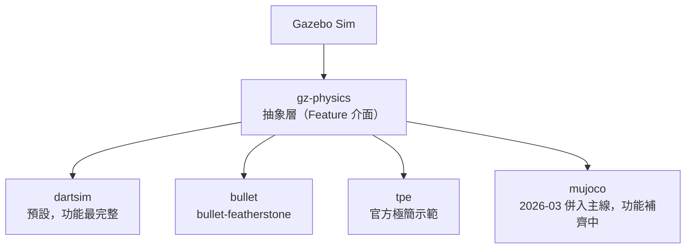
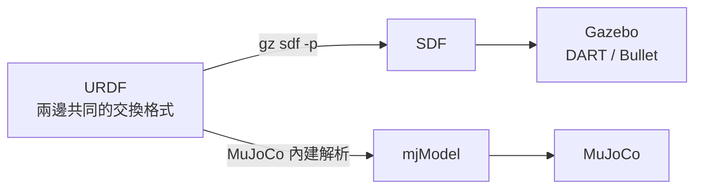

# 06｜Gazebo 與 MuJoCo：物理引擎外掛機制與模型互通

> 來源：[Gazebo Sim: Physics engines](https://gazebosim.org/api/sim/9/physics.html)、[Switching physics engines](https://gazebosim.org/api/physics/6/switchphysicsengines.html)、[Use a custom engine with Gazebo Physics](https://gazebosim.org/api/physics/9/usecustomengine.html)、[gz-physics GitHub](https://github.com/gazebosim/gz-physics)、[gz-physics#299: MuJoCo plugin](https://github.com/gazebosim/gz-physics/issues/299)
>
> 擷取日期：2026-09-09
>
> ⚠️ 本章依 AGENTS.md 規範如實標示可行性：**官方並無維護中的 MuJoCo 物理引擎外掛**；文中所述客製外掛做法需在 Gazebo 環境實作，本機未安裝 Gazebo，程式碼未實測。

## 學習目標

- 理解 Gazebo 的外掛式物理引擎架構（gz-physics）
- 了解「在 Gazebo 中改用 MuJoCo」的真實可行性與現況
- 學會 URDF ↔ SDF ↔ MJCF 的模型互通方式

## 前置知識

- [05｜Isaac Sim 與 MuJoCo](../04-isaac-sim/01-isaac-sim-mujoco.md)

## Gazebo 的物理引擎架構

與 Isaac Sim 深度綁定 PhysX 不同，**Gazebo 的物理引擎是可插拔的**。Gazebo Sim 透過抽象層 [gz-physics](https://github.com/gazebosim/gz-physics) 在執行期選擇物理引擎：

- **DART**：預設引擎，功能最完整（與 MuJoCo 同屬廣義座標陣營）。
- **Bullet**：官方提供兩種變體（`bullet`、bullet-featherstone）。
- **Trivial Physics Engine**：官方示範用的極簡引擎，展示如何寫自己的外掛。



引擎是掛在 gz-physics 這層抽象介面底下的，所以能在執行期換掉 —— 這正是 Isaac Sim 做不到
的事（見 [05 章](../04-isaac-sim/01-isaac-sim-mujoco.md)）。

切換方式（需在 SDF world 或指令列指定）：

```xml
<physics name="1ms" type="dart">  <!-- 預設；也可為 bullet -->
```

```bash
gz sim --physics-engine gz-physics-bullet world.sdf
```

## 那 MuJoCo 呢？現況與可行性

gz-physics 的設計允許第三方實作新引擎外掛（官方教學：[Use a custom engine](https://gazebosim.org/api/physics/9/usecustomengine.html)）。針對 MuJoCo：

**官方 MuJoCo 外掛已經在 gz-physics 主線裡，正在逐項補功能。**（現況查證日期：2026-09-10）

- 初步實作（[PR #811](https://github.com/gazebosim/gz-physics/pull/811)，21 個檔案、+2158 行）
  於 **2026-03-14 合併**進主線。`mujoco/` 目錄現在與 `dartsim/`、`bullet/`、`tpe/` 並列。
- 之後持續開發：vendored MuJoCo 升到 3.11.0（2026-08-07）、關節速度命令（2026-09-05）、
  支援 `ConstructSdfCollision` 讓 gz-sim 能顯示接觸點（2026-09-09）。
- **還沒進正式發行版**：最新的 gz-physics9 9.0.0 發布於 2025-10-14，早於合併日 —
  要用得自己從主線建置。
- **功能覆蓋還不完整**：官方 [`mujoco/README.md`](https://github.com/gazebosim/gz-physics/blob/main/mujoco/README.md)
  逐一列出已實作的 Feature 與 TODO（例如 EntityManagement 的「以名稱取得 entity」「移除模型」
  仍未做）。開發分工與進度追蹤在 [issue #299](https://github.com/gazebosim/gz-physics/issues/299)（仍 open）。

結論：在 Gazebo 中換用 MuJoCo 已經從「要自己從頭寫外掛」變成「從主線建置、功能還不齊」。
生產環境現階段仍建議走模型互通路線；要嘗鮮或參與開發，官方外掛是可用的起點。

## 模型互通：URDF ↔ SDF ↔ MJCF



- Gazebo 原生格式是 **SDF**；`sdformat` 工具可把 URDF 轉成 SDF（`gz sdf -p robot.urdf > robot.sdf`）。
- MuJoCo 直接吃 URDF（見 [04｜URDF 匯入](../03-urdf-import/01-import-urdf.md)）。
- 因此 **URDF 是兩邊共同的交換格式**：維護一份 URDF，Gazebo 端轉 SDF，MuJoCo 端直接載入或再轉 MJCF。

> 譯註：也可以用本專案的 `scripts/load_urdf.py` 驗證同一份 URDF 在 MuJoCo 的行為，再到 Gazebo 用 SDF 版跑感測器與場景。

## 自製 MuJoCo gz-physics 外掛（進階，概念指引）

若確實要在 Gazebo 中跑 MuJoCo，路徑是：

1. 參考 `gz-physics/examples/simple_plugin` 建立外掛骨架；
2. 實作 gz-physics 的 Feature 介面（`SimulationFeatures`、`SDFFeatures`、關節/碰撞相關 Feature）；
3. 在外掛內部把請求轉成 MJCF/`mjSpec` 建模型，每步呼叫 `mj_step` 並回填狀態；
4. 以 `--physics-engine` 或 SDF `<physics type="...">` 載入。

工作量與限制需先有心理準備：gz-physics 的 Feature 集合龐大，MuJoCo 的廣義座標資料結構與
DART 式的 entity 抽象之間的映射（尤其接觸點回報、感測器）是最難的部分 — 官方外掛的 TODO
清單也集中在這幾塊。想動手前先讀 `mujoco/src/` 底下已完成的 Feature 實作，那是最好的範本。

## 常見錯誤與除錯

- **`apt` 裝不到 MuJoCo 外掛**：它在 gz-physics 主線，但還沒進發行版 — 要自己從原始碼建置。
- **URDF 轉 SDF 後行為不同**：檢查 `<gazebo>` 擴充標籤、慣性、以及 DART 與 MuJoCo 的接觸參數差異。
- **Gazebo 版本**：外掛 API 隨 gz-physics 大版本變動，教學連結請對應你安裝的 Gazebo 發行版（Harmonic = gz-physics 7/8 等）。

## 延伸閱讀

- [Gazebo Sim: Physics engines](https://gazebosim.org/api/sim/9/physics.html)
- [Switching physics engines](https://gazebosim.org/api/physics/6/switchphysicsengines.html)
- [Use a custom engine with Gazebo Physics](https://gazebosim.org/api/physics/9/usecustomengine.html)
- [gz-physics](https://github.com/gazebosim/gz-physics)、[MuJoCo 外掛說明](https://github.com/gazebosim/gz-physics/blob/main/mujoco/README.md)、[進度追蹤 issue #299](https://github.com/gazebosim/gz-physics/issues/299)
