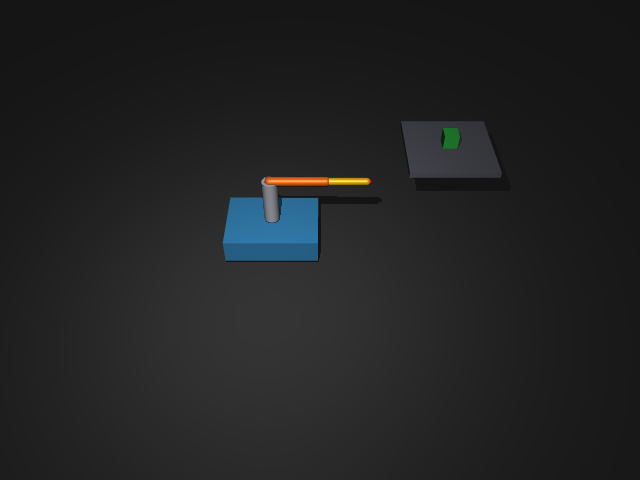

# 14｜AMR 實驗（二）：搬運車上的機械手臂（逆運動學 IK）

> 參考來源：[mj_jacSite — MuJoCo API Reference](https://mujoco.readthedocs.io/en/stable/APIreference/)（stable，MuJoCo 3.x）
> 擷取日期：2026-09-09
> 測試環境：Linux、MuJoCo 3.12.0、Python 3.12.3；範例已實測通過。

## 學習目標

- 在 AMR 底盤上裝三軸機械手臂（mobile manipulator）
- 用 `mj_jacSite` 取雅可比矩陣（Jacobian），實作阻尼最小平方法 IK
- 完成「開到貨架旁 → 末端對準箱子」的完整流程

## 前置知識

- [13｜AMR 叉車](01-amr-forklift.md)、基礎線性代數（矩陣、偽逆）

## 模型設計（`models/mobile_manipulator.xml`）



- **底盤**：同叉車篇的平面式簡化模型（x / y / yaw + velocity 致動器）。
- **手臂**：三個 hinge 關節 — `shoulder`（繞 z 軸，決定朝向）、`elbow`、`wrist`（繞 y 軸，決定伸展與高度）；末端放一個 `<site name="ee">` 作為夾爪參考點。
- **場景**：貨架上放一個自由箱子（freejoint），是 IK 的目標。

## 阻尼最小平方法 IK（Damped Least Squares）

要把末端位置 `p(q)` 移到目標 `p*`，對小位移有線性關係 `Δp ≈ J Δq`（J 是雅可比）。直接求偽逆在奇異點附近會爆炸，所以加阻尼 λ：

```
Δq = Jᵀ (J Jᵀ + λ²I)⁻¹ · (p* − p)
```

MuJoCo 幫你算 J，不用自己推：

```python
jacp = np.zeros((3, model.nv))
mujoco.mj_jacSite(model, data, jacp, None, ee_id)  # 平移雅可比
J = jacp[:, ARM_JOINTS]                             # 只取手臂關節那幾行
dq = J.T @ np.linalg.solve(J @ J.T + lam**2 * np.eye(3), err)
data.qpos[ARM_JOINTS] += 0.3 * dq                   # 步長縮放
```

迭代到 `‖err‖ < 5 mm` 為止。解出關節角後交給 `<position>` 伺服追蹤。

## 完整流程（`scripts/ex_mobile_manipulator.py`）

1. **底盤 P 控制**開到貨架旁的停車點（速度上限 + 到點煞車）；
2. 以箱子位置為目標跑 **IK**（只調手臂三關節，底盤不動）；
3. **position 伺服**把手臂開到 IK 解，驗證末端誤差。

實測輸出：

```
起始底盤: x=0.00 y=0.00
到位後底盤: x=0.73 y=0.43
箱子位置: [1.2  0.5  0.48]
IK 前末端位置: [1.352 0.411 0.479]
IK 收斂: True, 目標關節角 = [ 0.177 -0.528  1.399]
到達後末端位置: [1.187 0.488 0.461], 誤差 = 2.6 cm
結果：搬運車機械手臂成功抵達目標 ✓
```

## 開發中踩過的坑（本章除錯紀錄）

1. **底盤衝過頭撞飛箱子**：固定速度命令開環行駛，衝過停車點把目標箱推走。解法：P 控制（誤差小就減速）+ 到點後 `ctrl=0` 煞車停穩。
2. **IK 卡住不收斂（誤差停在 5 cm）**：目標其實**超出手臂工作空間** — 水平距離 0.67 m，手臂全伸只有 0.62 m。阻尼最小平方法在邊界上會停在「全伸展」的局部最小值。解法：把停車點開近一點。**IK 不收斂時，第一件事是檢查目標可不可達。**
3. **硬 clip 步長造成震盪**：`np.clip(dq, ±0.5)` 會讓迭代在兩個狀態間跳；改成固定比例縮放（`0.3 * dq`）就收斂了。

## 常見錯誤與除錯

- **`mj_jacSite` 維度**：`jacp` 是 `(3, nv)`；nv 是自由度數（本例底盤 3 + 手臂 3 + 箱子 freejoint 6 = 12），記得只取手臂那幾行。
- **IK 收斂但伺服追不到**：位置伺服有穩態誤差時調大 `kp`，或檢查 `ctrlrange`。
- **qpos/qvel 索引不同**：freejoint 的 qpos 是 7 維（含四元數）但 qvel 是 6 維 — 手動用索引前先想清楚。

## 延伸閱讀

- [mj_jacSite — API Reference](https://mujoco.readthedocs.io/en/stable/APIreference/)
- 下一步：加上姿態（orientation）誤差做 6D 末端控制（`mj_jacSite` 的 `jacr`）、軌跡規劃、或用第 08/09 章的 RL 訓練抓取策略
