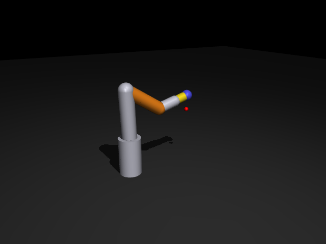

# 15｜六軸手臂的 6D IK：位置與姿態同時控制

> 參考來源：[mj_jacSite / mju_mulQuat / mju_negQuat — MuJoCo API Reference](https://mujoco.readthedocs.io/en/stable/APIreference/)、[MuJoCo Python 教學中的 differential IK](https://mujoco.readthedocs.io/en/stable/python.html)（stable，MuJoCo 3.x）
> 擷取日期：2026-09-09
> 測試環境：Linux、MuJoCo 3.12.0、Python 3.12.3；範例已實測通過。

## 學習目標

- 把 [14 章](02-mobile-manipulator.md) 的 3D 位置 IK 升級成 **6D（位置 + 姿態）**
- 學會 `mj_jacSite` 的旋轉雅可比（`jacr`）與四元數姿態誤差的正確寫法
- 理解 MuJoCo 四元數慣例（w, x, y, z）

## 前置知識

- [14｜AMR 實驗（二）：IK](02-mobile-manipulator.md)

## 模型：六軸手臂（`models/arm6.xml`）



六個 hinge 關節（j1 繞 z，j2–j4 繞 y，j5 繞 z，j6 繞 y），末端 `<site name="ee">`。6D 姿態需要至少 6 個自由度 — 這也是本章從 14 章的三軸手臂換成六軸的原因。

## 6D 阻尼最小平方法 IK

概念與 14 章相同，只是誤差與雅可比都從 3 維變 6 維：

```python
mujoco.mj_jacSite(model, data, jacp, jacr, ee_id)   # jacp 平移、jacr 旋轉
J = np.vstack([jacp[:, JOINTS], jacr[:, JOINTS]])  # (6, 6)
dq = J.T @ np.linalg.solve(J @ J.T + lam**2 * np.eye(6), err)
data.qpos[JOINTS] += 0.4 * dq
```

### 姿態誤差：用四元數差的向量部分（關鍵）

```python
mujoco.mju_negQuat(conj, site_quat)            # 共軛 = 逆旋轉
mujoco.mju_mulQuat(eq, target_quat, conj)      # 差旋轉 = 目標 ⊗ 目前⁻¹
if eq[0] < 0:
    eq = -eq                                   # 四元數雙重覆蓋，取短路徑
err_ori = eq[1:]                               # 向量部分 ≈ 半旋轉向量
```

> ⚠️ **本章最大的坑**：一開始改用 `mju_subQuat`（軸角向量）當姿態誤差，結果 12 組參數全部發散。數值實驗證明它的輸出參考系與 `jacr` 不一致（在 180° 奇異點附近尤其明顯）。官方 Python 教學用的就是上面的「四元數差向量部分」寫法 — 對齊附近向量部分約等於旋轉向量的一半，與 `jacr` 相容。**姿態誤差不要自己發明，用官方配方。**

### 四元數慣例

MuJoCo 四元數是 **(w, x, y, z)**（`target_quat = [0, 1, 0, 0]` 是繞 **x** 軸轉 180°，不是 y）。與 ROS 的 (x, y, z, w) 順序不同，跨系統時務必檢查。

## 實測結果

目標：末端到 (0.35, 0, 0.30) 且 z 軸朝下（夾取姿態）。

```
IK 前誤差: pos=0.721 m, ori=2.000 rad
IK 收斂: True（30 次迭代）
到達後誤差: pos=1.11 cm, ori=0.036 rad
結果：6D 位置與姿態同時到達 ✓
```

30 次迭代收斂，position 伺服追蹤後位置誤差約 1 cm。

## 開發中踩過的坑（本章除錯紀錄）

1. **`mju_subQuat` 當姿態誤差 → 發散**：參考系與 `jacr` 不一致，改用官方的四元數差向量部分後 27 次迭代就收斂。
2. **IK 收斂但伺服追不到（4 cm / 0.54 rad）**：IK 解的 j5=3.13 rad 超出模型原本的關節範圍 ±2.6，被 `ctrlrange` 夾住。解法：放寬腕部關節範圍到 ±π — **IK 解一定要檢查關節限位**。
3. **在 IK 迭代內硬 clip 關節限位反而卡住**：會被困在邊界上的不可行解。讓 IK 自由探索、事後檢查限位即可（或換初始猜值）。

## 延伸閱讀

- [MuJoCo Python tutorial（differential IK 節）](https://mujoco.readthedocs.io/en/stable/python.html)
- 下一步：null-space 投影（利用冗餘自由度避開障礙物）、軌跡插值、夾爪抓取閉環
