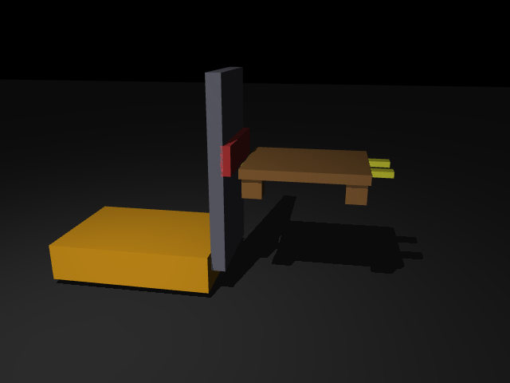

# 16｜棧板材質實驗：木頭 vs 塑膠（20 kg 載重摩擦測試）

> 參考來源：[Contact parameters / friction — MuJoCo XML Reference](https://mujoco.readthedocs.io/en/stable/XMLreference.html)（stable，MuJoCo 3.x）
>
> 擷取日期：2026-09-09
>
> 測試環境：Linux、MuJoCo 3.13.0、Python 3.12.3；範例已實測通過。

## 學習目標

- 建立木頭棧板與塑膠棧板（皆 20 kg）放在牙叉上的場景
- 牙叉上上下下、左右左右移動，驗證棧板是否滑動 / 掉落
- 學會 MuJoCo 的接觸摩擦合併規則（本章最大的坑）

## 前置知識

- [13｜AMR 叉車](01-amr-forklift.md)

## 場景設計

`models/amr_pallet_template.xml`：13 章的叉車（底座固定，專注牙叉動作）+ 棧板模板。棧板是「板面 + 四隻腳」、質量 20 kg（`<inertial>` 明確指定），腳底直接貼在牙叉頂面上。材質以模板變數替換：

| 棧板 | 顏色 | 摩擦係數 μ |
| --- | --- | --- |
| 木頭 | 棕色 | 0.6 |
| 塑膠 | 藍色 | 0.35 |

 

## ⚠️ 摩擦合併規則：本章最大的坑

第一版實驗中，木頭與塑膠的結果**完全一樣**。原因：MuJoCo 接觸的摩擦係數由兩個 geom 的 `friction` 合併，預設（相同 priority 下）是**取最大值**。牙叉設了 μ=1.0，於是 `max(1.0, 0.6) = max(1.0, 0.35) = 1.0` — 棧板材質根本沒生效。

解法：牙叉調低（0.1），讓棧板端的 μ 成為有效值：木頭 `max(0.1,0.6)=0.6`、塑膠 `max(0.1,0.35)=0.35`。

## 實驗流程（`scripts/ex_pallet_materials.py`）

升 → 降 → 急左移 → 急右移（來回兩次）→ 再升 → 再降；每階段記錄棧板位置，滑動量以**相對牙叉的位移**計算（扣除側移關節本身的位移）。

## 實測結果

```
=== 木頭棧板（20 kg, μ=0.6）===        === 塑膠棧板（20 kg, μ=0.35）===
  急左移 → 相對滑動 +0.006               急左移 → 相對滑動 +0.006
  急右移 → 相對滑動 -0.007               急右移 → 相對滑動 -0.008
  ...                                    ...
  相對滑動量 = 0.4 cm,  留在牙叉上 ✓      相對滑動量 = 11.9 cm, 留在牙叉上 ✓
```

- **木頭棧板**：幾乎不滑（0.4 cm），高摩擦讓棧板跟著牙叉走。
- **塑膠棧板**：激烈側移時明顯滑動，最終滑移 11.9 cm、偏離牙叉中心 — 接近滑落的邊緣，符合低摩擦材質的物理直覺。
- 兩者都沒有掉落（通過驗證），但塑膠棧板的偏移量提醒：實務上搬運塑膠棧板需要更平緩的加減速。

## 開發中踩過的坑（本章除錯紀錄）

1. **摩擦取 max**：見上方「摩擦合併規則」。
2. **牙叉升不起來（20 kg 載重幾乎不動）**：滑架 geom 與門架 geom 之間的接觸摩擦把升降鎖死（約束力 -1171 N 正好抵銷致動力）。解法：滑架設 `contype="0" conaffinity="0"` — 內部機構間的接觸通常不需要模擬。
3. **量測基準錯誤**：`home` 在 `mj_forward` 之前記錄會全是 0；且側移時棧板跟著動是正常的，**滑動要扣掉牙叉關節位移**才算。
4. **升降 overshoot**：kp 調高後 20 kg 會衝過頭，加 `kv`（速度阻尼）就收斂乾淨。

## 延伸閱讀

- [Contact / friction — XML Reference](https://mujoco.readthedocs.io/en/stable/XMLreference.html)
- 下一步：加入傾斜（mast tilt）測試、不同重心偏移、或棧板掉落邊界的掃參實驗
