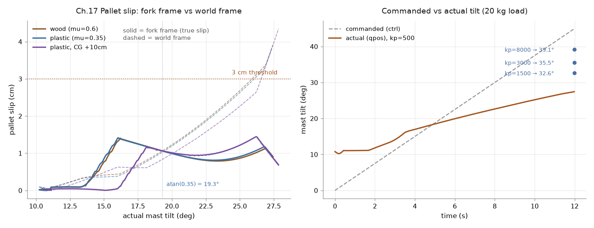

# 17｜門架前傾實驗：棧板滑落邊界（木頭 vs 塑膠、重心偏移）

> 參考來源：[Contact parameters — MuJoCo XML Reference](https://mujoco.readthedocs.io/en/stable/XMLreference.html)（stable，MuJoCo 3.x）
>
> 擷取日期：2026-09-09
>
> 測試環境：Linux、MuJoCo 3.12.0、Python 3.12.3；範例已實測。

## 學習目標

- 幫叉車門架加上前傾（tilt）自由度
- 用掃參實驗觀察棧板在傾斜叉齒上的行為
- **在會轉動的載具上，滑動與翻倒要在哪個座標系量**
- **position 致動器的 `ctrl` 是目標值，不是實際角度**

## 前置知識

- [16｜棧板材質實驗](04-pallet-materials.md)（含摩擦合併規則的坑）

## 模型與實驗設計

`models/amr_tilt_template.xml`：門架改為可繞 y 軸前傾的 hinge（`tilt`，position 伺服控制，
`kp=500`、關節上限 0.8 rad = 45.8°），棧板同 16 章（20 kg，板面 + 四腳）。

`scripts/ex_tilt_boundary.py`：目標角在 12 秒內從 0 線性掃到 45°，全程以 50 Hz 記錄
目標角、實際角、兩種座標系下的滑移，以及棧板相對叉齒的姿態偏離。

三個案例：木頭（μ=0.6）、塑膠（μ=0.35）、塑膠 + 重心前移 10 cm（`<inertial pos>` 偏移）。

判定條件：

- **開始滑動**：棧板在**叉齒座標系**中的位移 > 3 cm
- **掉落**：棧板**相對叉齒**的姿態偏離 > 30°，或在叉齒座標系滑出 25 cm

## 實測結果

```
木頭棧板: 門架 10.8° → 27.5°（目標掃到 45°，kp=500 追不上）
    叉齒座標系滑移 0.9 cm（世界座標量會是 3.9 cm），棧板相對叉齒最大偏轉 3.3°
    開始滑動 @ None，掉落 @ None（理論滑動角 atan(μ) = 31.0°）
塑膠棧板: 門架 10.8° → 27.4°
    叉齒座標系滑移 0.9 cm（世界座標量會是 3.8 cm），棧板相對叉齒最大偏轉 3.2°
    開始滑動 @ None，掉落 @ None（理論滑動角 atan(μ) = 19.3°）
塑膠棧板+重心前移10cm: 門架 10.6° → 27.9°
    叉齒座標系滑移 0.7 cm（世界座標量會是 4.4 cm），棧板相對叉齒最大偏轉 2.7°
    開始滑動 @ None，掉落 @ None
```

[](../../runs/tilt_boundary.png)

左圖：實線是叉齒座標系量到的真實滑移，虛線是世界座標。右圖：命令角與實際角的落差，
以及提高 `kp` 之後能追到哪。資料：[runs/tilt_boundary_log.csv](../../runs/tilt_boundary_log.csv)、
[runs/tilt_kp_sweep.csv](../../runs/tilt_kp_sweep.csv)。

## 兩個量測陷阱

**滑動要在叉齒座標系量。** 世界座標的曲線（虛線）一路爬到 3.9 cm，看起來像棧板正在
持續滑出去；叉齒座標系（實線）最多只到 1.4 cm，而且會回落 — 棧板是在叉齒上前後晃動，
沒有真的滑走。差額全是「門架轉過去、棧板跟著被帶過去」的位移。

16 章用「減掉牙叉的 y 位移」就夠了，因為那裡的車體只做平移。這裡門架會**轉動**，
純減平移補不掉旋轉，得做完整的座標轉換：

```python
Rf = data.xmat[fork_id].reshape(3, 3)
pos_in_fork = Rf.T @ (data.xpos[pallet_id] - data.xpos[fork_id])
```

**翻倒也要在叉齒座標系判。** 棧板乖乖貼在傾斜的叉齒上時，它對**世界**的傾角就等於門架
傾角 — 拿這個判翻倒，門架傾到 30° 就會報告「棧板翻了」。實測棧板相對叉齒的偏離全程
不超過 3.3°，根本沒翻。判定要用相對姿態：

```python
R_rel = Rf.T @ data.xmat[pallet_id].reshape(3, 3)
angle = np.degrees(np.arccos(np.clip(R_rel[2, 2], -1, 1)))
```

## 為什麼傾不到 45°

`ctrl` 給的是目標角，實際角度要從 `qpos` 讀。20 kg 棧板壓在伸出去的叉齒上，
對 tilt 關節產生的力矩超過 `kp=500` 的伺服能撐的範圍：

| `kp` | 靜置起點 | 12 秒掃描終點（目標 45°） | 叉齒座標系滑移 |
| ---: | ---: | ---: | ---: |
| 500（模型預設） | 10.79° | 27.5° | 0.9 cm |
| 1500 | 2.97° | 32.6° | 1.1 cm |
| 3000 | 1.43° | 35.5° | 2.0 cm |
| 8000 | 0.52° | 39.1° | 3.0 cm |

連「靜置起點」都不是 0°：`ctrl=0` 時重力已經把門架拉下 10.8°，伺服拉不回來。
關節上限是 45.8°，全程沒有撞到 — 追不上純粹是增益不足。

## 這個實驗沒能回答的問題

**沒有找到滑落邊界。** 在門架實際能達到的角度內（`kp=500` 是 27.5°，`kp=8000` 是 39.1°），
三種材質的棧板都沒有滑走。塑膠的理論滑動角 atan(0.35) = 19.3° 明明已經被超過，實測滑移
仍只有 0.9 cm — 準靜態緩慢傾斜下，接觸求解器維持在 stick 狀態，沒有進入持續滑動。

要真的找到邊界，可走的方向：把 `kp` 提高並放大關節上限、換成動態傾倒（快速甩）、
或減少載重讓伺服追得上。這些都還沒做。

**三種材質沒有分出差異**，因為根本沒有進入滑動區。16 章那種材質差異（0.4 cm vs 11.9 cm）
是在有專用側移機構、能製造足夠橫向加速度的條件下量到的；這裡的準靜態傾斜製造不出那個條件。

## 開發中踩過的坑（本章除錯紀錄）

1. **掉落判定用絕對高度**：門架前傾本身就會讓棧板降低（幾何關係），10.8° 就全員誤報掉落。
2. **改用棧板對世界的翻轉角，仍然錯**：棧板貼在傾斜叉齒上時，它對世界的傾角就是門架傾角，
   門架傾到判定門檻就會誤報翻倒。要用**相對叉齒**的姿態偏離。
3. **滑動量用世界座標**：會把「門架轉過去帶著棧板走」算成滑動，量到的值是真實滑移的四倍多。
4. **傾斜方向裝反**：`axis="0 -1 0"` 讓叉齒往上翹，棧板往門架滑還被門架擋住，永遠不會掉。
5. **把 `ctrl` 當成實際角度**：本章所有角度都必須從 `qpos` 讀。載重下的 position 伺服有明顯
   穩態誤差，命令 45° 實際只有 27.5°；照著命令值寫結論，會宣稱一個從沒發生過的實驗條件。

## 延伸閱讀

- [Contact parameters — XML Reference](https://mujoco.readthedocs.io/en/stable/XMLreference.html)
- [20｜新模型重跑](08-rerun-real-model.md) — 同一條「滑動要在牙叉座標系量」的教訓
- 下一步：提高 `kp` 並放大關節上限找真正的掉落邊界、堆疊兩層棧板、把 tilt 加入完整搬運任務
