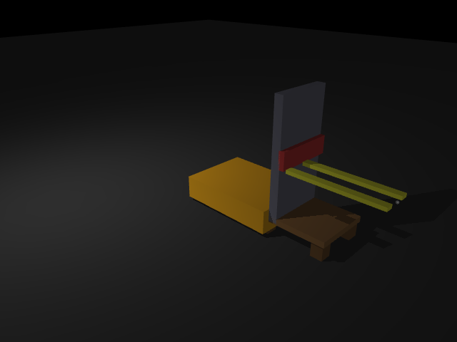
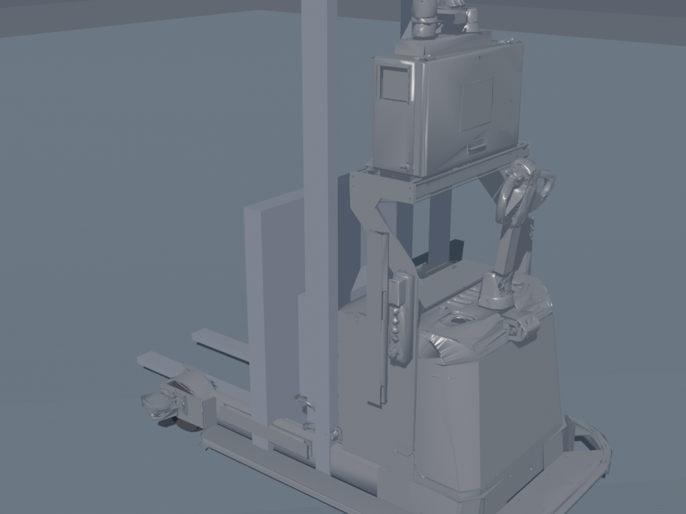
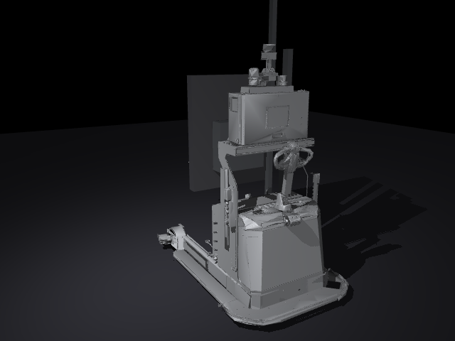

# 18｜真實 mesh 叉車模型：MR1533（TB3 實驗資產）+ Blender headless 渲染

> 資產來源：`~/tmp2/TB3/assets/mr1533_light/`（MR1533 三輪舵輪叉車，Blender 4.2 建模、OBJ mesh + URDF）
>
> 參考：[Mesh assets — MuJoCo XML Reference](https://mujoco.readthedocs.io/en/stable/XMLreference.html#asset-mesh)
>
> 擷取日期：2026-09-10
>
> 測試環境：Linux、MuJoCo 3.13.0、Python 3.12.3、Blender 4.2.11（headless）；範例已實測通過。

## 學習目標

- 把 Blender 建模的 OBJ mesh 匯入 MJCF（視覺與碰撞分離的正確做法）
- 依 URDF 關節配置在 MJCF 中重建運動學樹
- 用 Blender headless 渲染高品質展示圖

## 前置知識

- [13｜AMR 叉車](01-amr-forklift.md)、[04｜URDF 匯入](../03-urdf-import/01-import-urdf.md)

## 為什麼不用基本幾何體就好？

13 章的叉車是盒子堆出來的 — 教學清楚但外觀簡陋。真實專案會有 CAD/Blender 建的 mesh。本章用 TB3 實驗的 MR1533 叉車展示完整流程。

| 基本幾何版（13 章） | mesh 版（本章） |
| --- | --- |
|  |  |

## 視覺與碰撞分離（重要原則）

74k 面的 chassis mesh 直接當碰撞會又慢又不穩。標準做法：

```xml
<default>
  <default class="visual">
    <geom contype="0" conaffinity="0" group="2"/>   <!-- 視覺 mesh 不碰撞 -->
  </default>
</default>

<geom class="visual" type="mesh" mesh="chassis"/>    <!-- 看的 -->
<geom type="box" size="0.55 0.65 0.30" pos="1.15 0 0.35"/>  <!-- 撞的 -->
```

## 從 URDF 重建運動學樹

對照 `mr1533_light.urdf` 的關節配置（原點都是相對座標）：

| URDF joint | 型態 | MJCF 對應 |
| --- | --- | --- |
| stage（桯架前後） | prismatic x | 簡化為固定 |
| z1（升降一級） | prismatic z, 0~1.5 m | `<joint name="lift1" type="slide" axis="0 0 1">` |
| z2（升降二級） | prismatic z, 0~1.5 m | 同上 |
| tilt（牙叉前傾） | revolute y, 0~5° | `<joint name="tilt" type="hinge" axis="0 1 0">`（放寬到 ±17°） |
| 底盤 | （URDF 無，Isaac 端由控制器給） | 平面三關節 x/y/yaw |

叉齒碰撞盒的位置是直接量測 mesh 頂點得到的（叉齒區：x −1.15~0.09、y ±(0.15~0.48)、z −0.23~−0.19）— 讀 OBJ 頂點座標是對齊碰撞盒最可靠的方式。

## Blender headless 渲染（`scripts/render_mr1533_blender.py`）

```bash
blender --background ~/tmp2/TB3/assets/mr1533_light/mr1533_light.blend \
        --python scripts/render_mr1533_blender.py -- 輸出.png
```

腳本內容：清掉場景舊相機/光源 → 建相機（`to_track_quat("-Z","Y")` 對準目標）→ 太陽光 + 環境光 → EEVEE 渲染輸出。

## 實測結果

MuJoCo 端動作驗證（`scripts/ex_mr1533.py`）：

```
前進後 x = 0.47 m
升起後 lift1 = 0.951 m, lift2 = 0.456 m
前傾後 tilt = 9.5°，叉尖世界座標 = [0.17 0. 1.67]
結果：MR1533 mesh 模型動作驗證通過 ✓
```



## 開發中踩過的坑（本章除錯紀錄）

1. **升降被鎖死（actuator 1200N 對約束 -1171N）**：叉齒碰撞盒與底盤碰撞盒初始重疊，摩擦鎖死。解法：把底盤碰撞盒縮小讓開叉齒行程 — 同 16 章滑架/門架的教訓，**機構內部重疊是最常見的「關節不動」原因**。
2. **離屏渲染尺寸上限**：`mujoco.Renderer` 預設 framebuffer 只有 640×480，要更大解析度得在 XML 加 `<visual><global offwidth/offheight>`。
3. **Blender 渲染全白過曝**：預設世界光太亮；調低 Background strength 到 0.5、曝光 -0.7。
4. **Blender 4.x API**：`scene.objects.unlink()` 已移除，改用 `bpy.data.objects.remove()`。

## 延伸閱讀

- TB3 實驗文件：`~/tmp2/TB3/docs/vehicles/mr1533.md`（Isaac Sim 導航實驗）
- [Mesh assets — XML Reference](https://mujoco.readthedocs.io/en/stable/XMLreference.html#asset-mesh)
- 下一步：把 16/17 章的棧板實驗搬到這台車上（mesh 視覺 + 完整取貨流程）
