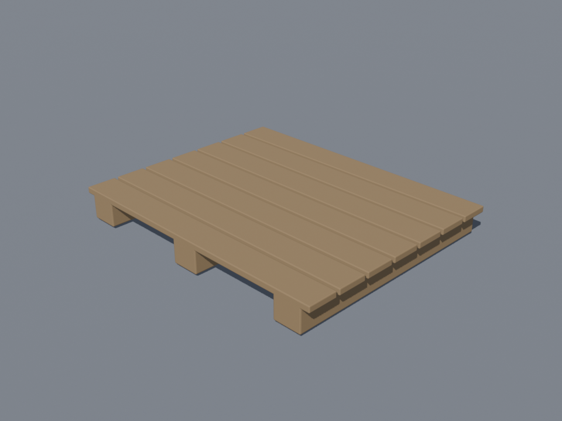
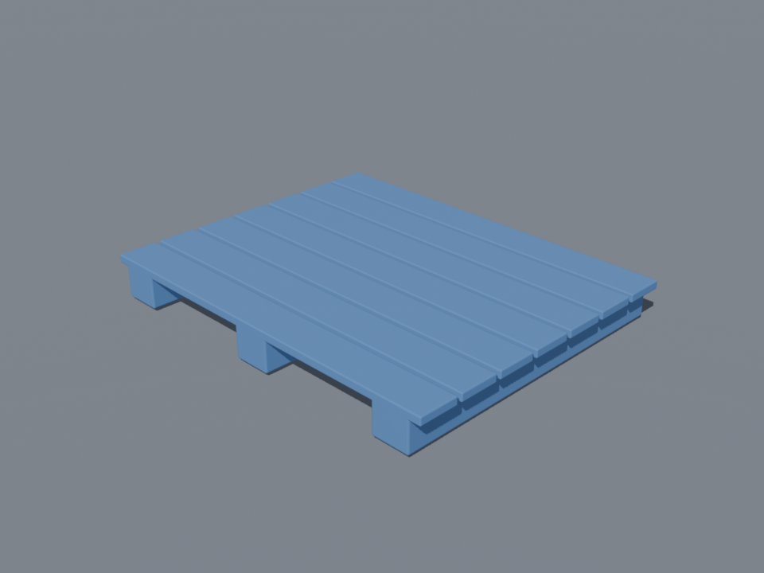
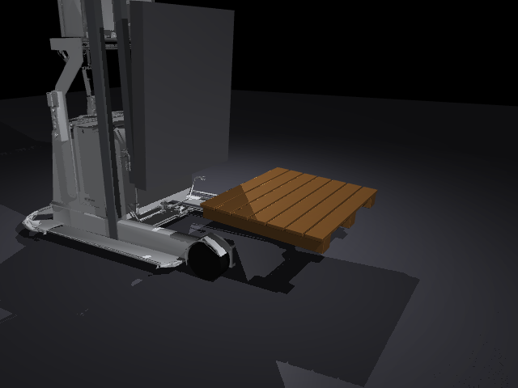

# 19｜Blender 程序化建模：木棧板 / 塑膠棧板 + 匯入 MuJoCo

> 參考來源：[mesh — MuJoCo XML Reference](https://mujoco.readthedocs.io/en/stable/XMLreference.html#asset-mesh)（stable，MuJoCo 3.x）
>
> 擷取日期：2026-09-10
>
> 測試環境：Linux、Blender 4.2.11（headless）、MuJoCo 3.13.0、Python 3.12.3；範例已實測通過。

## 學習目標

- 用 Blender headless 程序化建出木棧板與塑膠棧板（7 片板條 + 3 根枕木、倒角）
- 匯出 STL 匯入 MuJoCo（視覺 mesh + 簡化碰撞）
- 理解 MuJoCo 編譯器對 mesh 的**主軸重新對齊**行為（本章最大的坑）
- 在 MR1533 叉車上重跑上下左右載重驗證

## 前置知識

- [16｜棧板材質實驗](04-pallet-materials.md)、[18｜MR1533 mesh 叉車](06-mr1533-mesh.md)

## Blender 建模（`scripts/make_pallet_blender.py`）

完全用程式碼建模（不需要美術）：

```python
def build_pallet(mat):
    # 7 片頂板（留 12mm 縫）
    for i in range(7):
        box(f"deck{i}", (0, y_i, FOOT_H + DECK_T/2), (L, bw, DECK_T), mat, bevel=0.003)
    # 3 根縱向枕木
    for x in (-L/2+0.08, 0, L/2-0.08):
        box(f"stringer{x}", (x, 0, FOOT_H/2), (0.1, W, FOOT_H), mat, bevel=0.004)
    # join 成單一 mesh → STL 匯出
```

尺寸 1.0 × 0.8 m（歐規棧板比例簡化），木頭 μ 對應棕色粗糙材質、塑膠對應藍色略亮材質。同腳本直接 EEVEE 渲染展示圖：

```bash
blender --background --python scripts/make_pallet_blender.py -- <repo根目錄>
```

| 木頭棧板 | 塑膠棧板 |
| --- | --- |
|  |  |

## ⚠️ 本章最大的坑：MuJoCo 會重新對齊 mesh 主軸

MuJoCo 編譯器對每個 mesh 做預處理：**以質量中心重新置中，並旋轉到主慣性軸**（offsets 存在 `mjModel.mesh_pos` / `mesh_quat`）。對稱性高的物體（如棧板）主軸方向幾乎是任意的 — 我們的棧板就被轉成「立起來」。

排查過程（血淚順序）：

1. 先懷疑 Blender OBJ 匯出的軸向（`up_axis`/`forward_axis`）→ 做了單位方塊實驗，確認 `forward_axis="Y", up_axis="Z"` + 套用全部變換是恆等映射；
2. 換了還是歪 → 用手寫的封閉方塊 OBJ 對照實驗，證明 **MuJoCo 讀 OBJ/STL 不動軸向**，是主軸對齊在作怪；
3. 試圖用 `mesh_quat` 手動補償 → 越補越歪；
4. **結論：幾乎不用補償** — 編譯器會把 offsets 自動與 geom 的位姿組合，mesh geom 用單位位姿渲染出來就是原始方向。真正的修法是**改用 STL（三角面、無群組）並把零件 join 成單一 mesh**，讓主軸對齊拿到正確的幾何。

## MuJoCo 整合與驗證

`models/mr1533_pallet_template.xml`：18 章的 MR1533 + Blender 棧板（視覺 mesh + 板面/枕木碰撞盒 + 明確 20 kg `<inertial>`）。

`scripts/ex_mesh_pallet.py` 實測（木頭 μ=0.6 / 塑膠 μ=0.35）：

```
=== 木頭棧板（Blender mesh, 20 kg, μ=0.6）===
插入後: 底盤 x=-0.72, 棧板 z=-0.000
抬起後: 棧板 z=0.352
  最終棧板 z=0.351（抬起時 0.352）, 相對滑動 = 0.6 cm, 掉落 = False, 脫離叉齒 = False

=== 塑膠棧板（Blender mesh, 20 kg, μ=0.35）===
抬起後: 棧板 z=0.351
  最終棧板 z=0.348（抬起時 0.351）, 相對滑動 = 2.2 cm, 掉落 = False, 脫離叉齒 = False
```

流程是「插取 → 抬起 → 左右橫移 → 停穩」。**沒有做「降到底再升起來」** —— 這台車的
載貨升降撐不住，降下時貨會脫離叉齒，再升起來實際上是重新插取（[20 章](08-rerun-real-model.md)
量過同一件事）。本章要驗的是 Blender 棧板 mesh 能不能被叉起來、載著走，不是測升降極限。

橫移取 0.2 m/s，那是 20 章掃出來兩種材質都留得住的強度（0.35 以上塑膠就會被甩落）。

**判定用「最終高度是否回到抬起時的值」**，不用「高度有沒有掉到地面」：貨脫離叉齒之後
可能卡在半空（20 章實測卡在 0.112 m），`z < 0.05` 那種判定會說「沒掉落」。也不用瞬時
接觸 —— 停穩時的震動會讓接觸短暫消失，造成誤判。



> 註：橫移由底盤 vy 提供（MR1533 無側移機構）。0.2 m/s 這個強度下兩種材質都幾乎不滑
> （0.6 / 2.2 cm），方向符合摩擦係數。要看材質對照請到 [16 章](04-pallet-materials.md)
> （急側移：木頭 0.4 cm vs 塑膠 11.9 cm）或 [20 章](08-rerun-real-model.md)的強度掃描。

## 常見錯誤與除錯

- **mesh 進來方向歪了**：先別懷疑匯出設定 — 用一個已知尺寸的封閉方塊做對照實驗，區分「匯出軸向」與「編譯器主軸對齊」。
- **OBJ 多物件群組**：MuJoCo 對 OBJ 群組/多物件的處理不如 STL 單一 mesh 單純，優先用 STL。
- **mesh 碰撞慢/不穩**：視覺 mesh 設 `contype="0" conaffinity="0"`，碰撞另用簡化幾何（18 章原則）。

## 延伸閱讀

- [mesh — XML Reference](https://mujoco.readthedocs.io/en/stable/XMLreference.html#asset-mesh)（`refpos`/`refquat`、主軸對齊說明）
- 下一步：棧板上再放貨箱（多體堆疊）、完整取貨→搬運→放置流程
