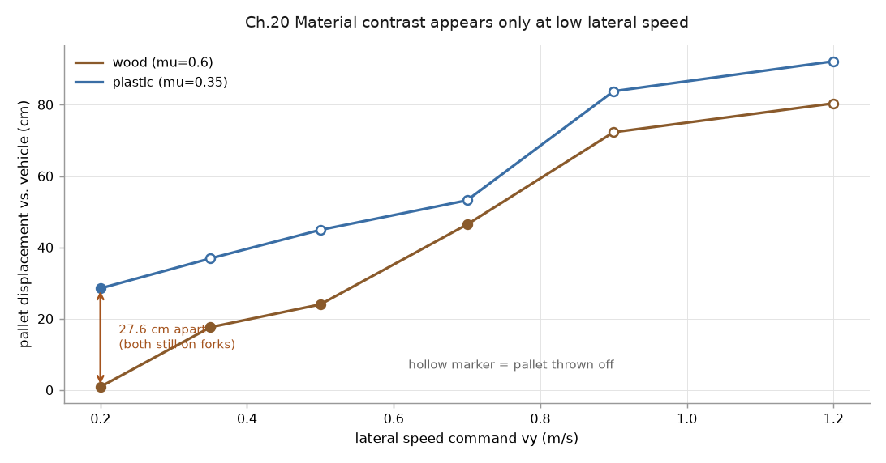

# 20｜新模型重跑：MR1533 + Blender 棧板的完整搬運驗證

> 擷取日期：2026-09-10
>
> 測試環境：Linux、MuJoCo 3.13.0、Python 3.12.3、Blender 4.2.11；全部範例已實測。

## 學習目標

- 把 13/16/17 章的實驗搬到真實比例模型（MR1533 mesh 叉車 + Blender 棧板）重跑
- 用多幀圖條（filmstrip）呈現實驗過程
- 理解「換了真實模型，實驗設計也要跟著改」的原因

## 前置知識

- [16｜棧板材質實驗](04-pallet-materials.md)、[17｜門架前傾](05-tilt-boundary.md)、[18｜MR1533 mesh 叉車](06-mr1533-mesh.md)、[19｜Blender 棧板](07-blender-pallet.md)

## 場景

`models/mr1533_pallet_template.xml` = MR1533 叉車（2000 kg）+ Blender 棧板（1.0×0.8 m、20 kg、枕木沿叉齒方向）：

[](../assets/strip_pickup.png)

上圖四幀：接近 → 牙叉插入叉孔 → 抬起 → 停穩（`scripts/make_strips.py` 產生）。

叉齒的碰撞盒要**對準棧板的叉孔**，不是隨便放在叉齒附近：叉孔的 z 範圍是 0～0.090
（枕木高度，板面底在 0.090），y 開口在中間枕木與外側枕木之間（0.05～0.37）。
沒對準的話叉車會變成「撞著棧板推」而不是「插進去抬」，而畫面上仍然是棧板被舉起來，
看不出問題（見本章除錯紀錄第 1 條）。

## 實驗一：材質摩擦（重跑 16 章）

`scripts/ex_rerun_materials.py`：插取 → 抬起 → 急左右橫移 ×3 → 量棧板相對車體的位移。
橫移強度 `vy` 從 0.2 掃到 1.2 m/s：

| `vy`（m/s） | 木頭（μ=0.6） | 塑膠（μ=0.35） | 差距 |
| ---: | ---: | ---: | ---: |
| **0.20** | **0.9 cm，留住** | **28.5 cm，留住** | **27.6 cm** |
| 0.35 | 17.6 cm，留住 | 36.9 cm，**掉落** | 19.4 cm |
| 0.50 | 24.0 cm，留住 | 44.9 cm，**掉落** | 20.8 cm |
| 0.70 | 46.4 cm，留住 | 53.2 cm，**掉落** | 6.8 cm |
| 0.90 | 72.3 cm，**掉落** | 83.8 cm，**掉落** | 11.5 cm |
| 1.20 | 80.4 cm，**掉落** | 92.2 cm，**掉落** | 11.8 cm |

[](../../runs/rerun_materials.png)

實心點表示棧板還在叉齒上，空心點表示被甩落。資料：
[runs/rerun_materials_log.csv](../../runs/rerun_materials_log.csv)。

**材質差異在低速區最清楚**：`vy = 0.2 m/s` 時木頭幾乎不滑（0.9 cm）、塑膠滑了 28.5 cm，
差 27.6 cm，而且兩者都還在叉齒上。這與 16 章（木 0.4 / 塑膠 11.9 cm）同一個方向，
量級甚至更大。

**強度一拉高就只剩「都滑」**。`vy ≥ 0.35` 塑膠開始被甩落、`vy ≥ 0.9` 木頭也留不住。
飽和之後兩者的位移都逼近車體自己的行程（±0.72 m），差距反而縮小 —— 這時候量到的是
「車走了多遠」而不是「貨滑了多少」。

所以**「摩擦剛好不夠」的中間地帶在這台重型車上是做得出來的，只是它落在低速區**。
原本用滿幅 ±1.2 m/s 去測，等於一開始就跨過了上界。

> 這裡沒有做「載貨升降」那段。降到 `lift1+lift2` 低於約 0.25 時棧板會碰到地面，
> 再升起來就是**重新插取**而不是載著升降 —— 量到的是插取偏移量，不是材質造成的滑動。

## 實驗二：前傾卸貨（重跑 17 章）

MR1533 的 tilt 關節（±28°）緩慢前傾，量測棧板在**牙叉座標系**中的滑動與姿態：

```
tilt=  -4.7°  棧板 z=0.352  俯仰= 4.7°  牙叉座標系滑移=  0.0 cm  相對牙叉偏轉= 0.0°
tilt=  -9.0°  棧板 z=0.274  俯仰= 9.0°  牙叉座標系滑移=  0.0 cm  相對牙叉偏轉= 0.0°
tilt= -15.0°  棧板 z=0.169  俯仰=15.1°  牙叉座標系滑移=  0.1 cm  相對牙叉偏轉= 0.1°
tilt= -18.0°  棧板 z=0.124  俯仰=18.0°  牙叉座標系滑移=  0.4 cm  相對牙叉偏轉= 0.1°
tilt= -21.0°  棧板 z=0.108  俯仰=15.7°  牙叉座標系滑移=  4.2 cm  相對牙叉偏轉= 5.3°
tilt= -27.0°  棧板 z=0.074  俯仰=10.6°  牙叉座標系滑移= 12.7 cm  相對牙叉偏轉=16.4°
最終：棧板 z=0.063，牙叉座標系滑移 15.2 cm，相對牙叉偏轉 19.6°
```

**轉折點在 -18° 與 -21° 之間**：在那之前棧板的俯仰角與牙叉完全同步（相對偏轉 ≤ 0.1°、
滑移 ≤ 0.4 cm），貨就是被端著轉；-21° 起棧板前端碰到地面，俯仰角開始**落後**牙叉
（15.7° vs 21°），相對偏轉與滑移同時跳起來 —— 那是卸貨真正開始的時刻。

[](../assets/strip_tilt.png)

四幀：抬起 → 前傾 8° → 前傾 14° → 棧板前端著地。

### 與 17 章的差異

17 章的棧板重心在叉齒中段，慢傾時會蠕動下滑；本章棧板重心靠近叉尖，前傾時**重力力矩直接把棧板壓在叉面上**（法向力增加），完全不滑，跟著牙叉轉到著地 — 這正是真實叉車的卸貨方式：前傾放下貨物，不是讓它滑出去。

### 除錯紀錄

1. **叉齒的碰撞盒沒對準叉孔**：碰撞盒放在 z 0.070～0.100、y ±0.315，而叉孔是
   z 0～0.090、y 開口 0.05～0.37 —— 差了 10 mm 高度與 10 cm 側距，於是叉齒撞進棧板
   板面與外側枕木，變成「推著棧板走」。症狀很難察覺：棧板仍然被舉起來、腳本仍然印
   「驗證通過」，只有量接觸才看得到全程 15 mm 的持續穿透，以及「倒退插入」時棧板
   跟著車位移 0.67 m（等於車走的距離）。
2. **棧板初始位置就埋在叉齒裡**：放在 x = -0.4（範圍 -0.8～0），而叉齒 x 到 -0.60，
   一載入就重疊。要有「倒退插入」這個動作，棧板得放在叉齒構不到的地方（改為 -1.2）。
3. **「載貨升降」會讓貨落地**：`lift1+lift2` 低於約 0.25 時棧板碰到地面，再升起來是
   重新插取。量到的偏移量與材質摩擦無關，卻會被當成滑動記進結果。
4. **第一版掉落判定誤報**（16°「掉落」）：其實是棧板前端著地（正確卸貨），不是翻落 —
   判定條件要區分「著地」與「翻倒」。
5. **相對位移量測要選對參考系**：tilt 會旋轉牙叉座標系，用底盤座標量滑動會把幾何位移
   誤判成滑動（2 cm 門檻在 1° 就觸發）；改用牙叉座標系才對。
6. **`fell = z < 0.05` 在貨卡住時會漏判**：棧板脫離叉齒後卡在 0.112 m，既不在叉齒上
   也沒到地面，判定照樣是「沒掉落」。要同時檢查貨還在不在叉齒上。

## 結論

| 實驗 | 輕量模型（13–17 章） | 真實模型（本章） |
| --- | --- | --- |
| 材質滑動對照 | 木 0.4 / 塑膠 11.9 cm（專用側移關節） | 木 0.9 / 塑膠 28.5 cm（`vy = 0.2 m/s`） |
| 材質差異消失的條件 | — | `vy ≥ 0.35` 起塑膠被甩落，飽和後只量得到車的行程 |
| 前傾行為 | 蠕動下滑 | -18° 前完全跟隨牙叉，-21° 起前端著地、開始脫離 |

兩個平台都能分辨材質，**但都只在各自的「摩擦剛好不夠」區間裡**。真實模型的那個區間
落在低速側（`vy` 約 0.2），用滿幅急打會直接跨過去。選錯操作強度，得到的結論會是
「這個平台測不出材質差異」—— 而那是操作參數的問題，不是平台的問題。

## 延伸閱讀

- 各章除錯紀錄：[16](04-pallet-materials.md)、[17](05-tilt-boundary.md)、[18](06-mr1533-mesh.md)、[19](07-blender-pallet.md)
- 下一步：舵輪轉向模型（MR1533 是舵輪車，目前用簡化平面底盤）、滿載爬坡穩定性
