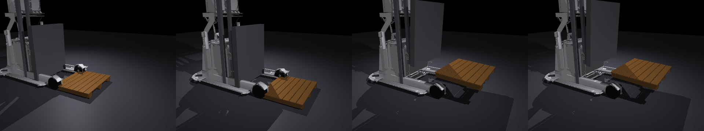
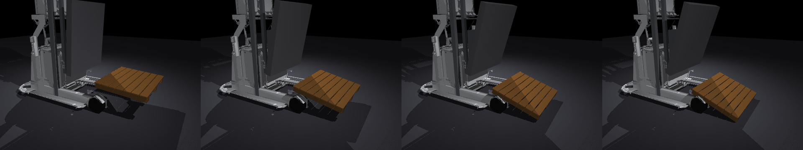

# 20｜新模型重跑：MR1533 + Blender 棧板的完整搬運驗證

> 擷取日期：2026-09-10
> 測試環境：Linux、MuJoCo 3.12.0、Python 3.12.3、Blender 4.2.11；全部範例已實測。

## 學習目標

- 把 13/16/17 章的實驗搬到真實比例模型（MR1533 mesh 叉車 + Blender 棧板）重跑
- 用多幀圖條（filmstrip）呈現實驗過程
- 理解「換了真實模型，實驗設計也要跟著改」的原因

## 前置知識

- [16｜棧板材質實驗](04-pallet-materials.md)、[17｜門架前傾](05-tilt-boundary.md)、[18｜MR1533 mesh 叉車](06-mr1533-mesh.md)、[19｜Blender 棧板](07-blender-pallet.md)

## 場景

`models/mr1533_pallet_template.xml` = MR1533 叉車（2000 kg）+ Blender 棧板（1.0×0.8 m、20 kg、枕木沿叉齒方向）：



上圖四幀：接近 → 牙叉插入棧板下方 → 抬起 → 停穩（`scripts/make_strips.py` 產生）。

## 實驗一：材質摩擦（重跑 16 章）

`scripts/ex_rerun_materials.py`：插取 → 抬起 → 升降兩次 → 急打橫移（vy 滿幅 ±1.2 m/s 來回三次）→ 量相對滑動。

```
木頭: 抬起 z=0.369 m, 相對滑動 = 15.7 cm, 留在牙叉上 ✓
塑膠: 抬起 z=0.369 m, 相對滑動 = 15.7 cm, 留在牙叉上 ✓
```

兩種材質的滑動量到小數點後一位都相同。

### 為什麼與 16 章結果不同（16 章：木 0.4 cm / 塑膠 11.9 cm）？

兩個模型結構不同：

1. **MR1533 沒有側移機構** — 橫移只能靠 2000 kg 底盤的 vy 伺服，加速度有限（即使調高 kv）。
2. 我們直接量測了接觸摩擦（`data.contact[i].friction`）確認木頭 0.6 / 塑膠 0.35 **確實生效**；再做了力度掃描：加速度約 4 m/s² 以下時兩者都只靠接觸**彈性變形**吸收（0.4–0.6 cm 是柔順變形不是滑動），更大加速度時兩者都進入飽和滑動、位移相近。
3. **要拉開差距需要「摩擦剛好不夠」的中間地帶**（μ·g 介於兩者之間的加速度）——在這台重型車的速度伺服上做不出來。本實驗的 vy 滿幅 ±1.2 m/s 急打已經跨過上界：兩種材質都進入飽和滑動，都滑了 15.7 cm。16 章的輕量車 + 專用側移關節反而才是材質對照的正確平台。

> 譯註：這是很有價值的一課 — **實驗平台決定能觀測的物理量**。換真實模型不是免費升級。

## 實驗二：前傾卸貨（重跑 17 章）

MR1533 的 tilt 關節（±28°）緩慢前傾，量測棧板在**牙叉座標系**中的滑動與姿態：

```
tilt= -4.3°  棧板 z=0.369  俯仰=4.3°
tilt= -6.9°  棧板 z=0.330  俯仰=6.9°
tilt= -9.8°  棧板 z=0.287  俯仰=9.8°
tilt=-12.4°  棧板 z=0.250  俯仰=12.4°
→ 棧板俯仰角完全跟隨牙叉，直到前端著地
```



四幀：抬起 → 前傾 8° → 前傾 14° → 棧板前端著地（最終 z=0.142）。

### 與 17 章的差異

17 章的棧板重心在叉齒中段，慢傾時會蠕動下滑；本章棧板重心靠近叉尖，前傾時**重力力矩直接把棧板壓在叉面上**（法向力增加），完全不滑，跟著牙叉轉到著地 — 這正是真實叉車的卸貨方式：前傾放下貨物，不是讓它滑出去。

### 除錯紀錄

1. **第一版掉落判定誤報**（16°「掉落」）：其實是棧板前端著地（正確卸貨），不是翻落 — 判定條件要區分「著地」與「翻倒」。
2. **相對位移量測要選對參考系**：tilt 會旋轉牙叉座標系，用底盤座標量滑動會把幾何位移誤判成滑動（2 cm 門檻在 1° 就觸發）；改用牙叉座標系才對。

## 結論

| 實驗 | 輕量模型（13–17 章） | 真實模型（本章） |
| --- | --- | --- |
| 材質滑動對照 | 木 0.4 / 塑膠 11.9 cm | 皆 15.7 cm（都飽和滑動，平台限制） |
| 前傾行為 | 蠕動下滑 | 跟隨牙叉轉到著地（真實卸貨） |

兩個平台回答不同的問題：輕量模型適合**隔離單一物理量**（摩擦係數的影響），真實模型適合**驗證操作流程**（取貨/卸貨動作是否成立）。

## 延伸閱讀

- 各章除錯紀錄：[16](04-pallet-materials.md)、[17](05-tilt-boundary.md)、[18](06-mr1533-mesh.md)、[19](07-blender-pallet.md)
- 下一步：舵輪轉向模型（MR1533 是舵輪車，目前用簡化平面底盤）、滿載爬坡穩定性
