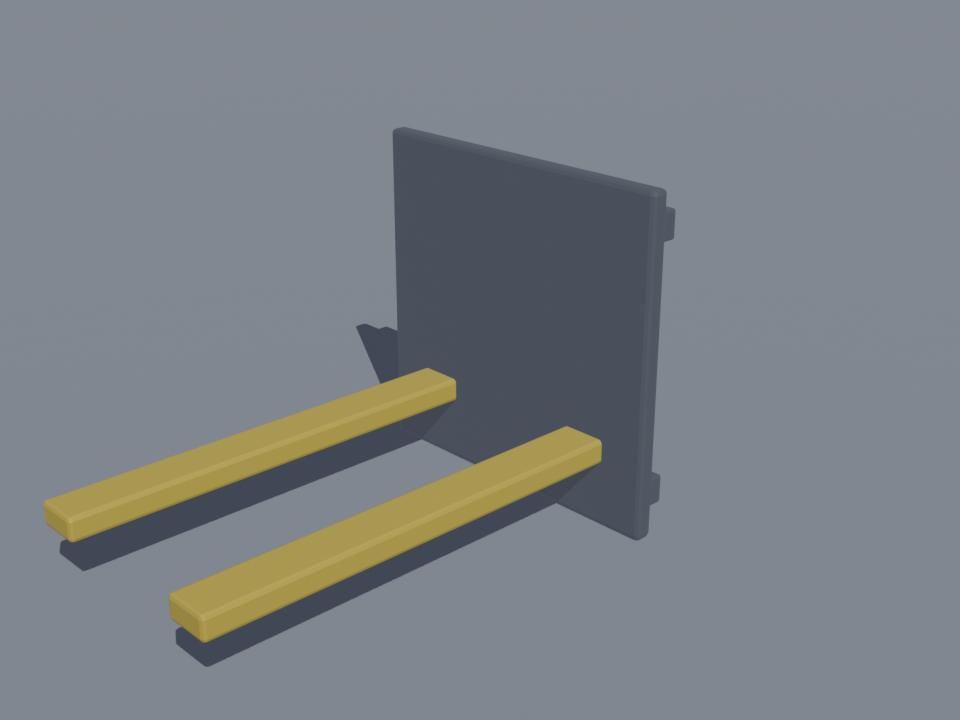
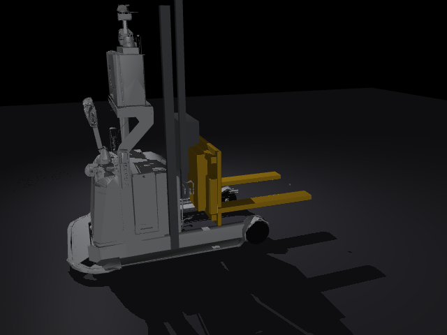

# 21｜新車型：MR1533 + y 向 reach 滑台（Blender headless 建模）

> 擷取日期：2026-09-10
>
> 測試環境：Linux、Blender 4.2.11（headless）、MuJoCo 3.12.0；範例已實測通過。

## 學習目標

- 在既有 mesh 車型上**新增自訂機構**：用 Blender 程序化建 reach 滑台
- MJCF 中新 body + slide 關節的掛接與碰撞對齊
- 完整的「建模 → 匯出 → 整合 → 驗證」流程

## 前置知識

- [18｜MR1533 mesh 叉車](06-mr1533-mesh.md)、[19｜Blender 棧板](07-blender-pallet.md)

## 需求

MR1533 原車的牙叉只能升降和前傾，沒有側移。本章加一個 **y 向 reach 滑台**：整組牙叉可沿 y 軸伸出 ±0.45 m — 用途是貨架側向取放、狹窄通道不轉車身即可對位。

## 步驟一：Blender 建機構（`scripts/make_yreach_blender.py`）

程序化建模（背板 + 上下導軌 + 滑座 + 兩根 L 形叉齒），金屬鋼材質 + 安全黃：

```bash
blender --background --python scripts/make_yreach_blender.py -- <repo根目錄>
```



沿用 19 章的教訓：所有零件**套用全部變換後 join 成單一 mesh、匯出 STL**，避免主軸對齊/群組問題。

## 步驟二：MJCF 掛接（`models/mr1533_yreach.xml`）

新滑台掛在原 tilt 關節之下（前傾仍然可用）：

```xml
<body name="fork" pos="-0.12 0 0">
  <joint name="tilt" type="hinge" axis="0 1 0" .../>
  <body name="yreach" pos="0 0 -0.375">          <!-- 對齊原叉齒高度 -->
    <joint name="reach_y" type="slide" axis="0 1 0" range="-0.45 0.45"/>
    <geom class="visual" type="mesh" mesh="yreach" rgba="0.85 0.65 0.1 1"/>
    <geom type="box" size="0.475 0.07 0.025" pos="-0.45 ±0.315 0.16"/>  <!-- 碰撞叉齒 -->
  </body>
</body>
```

- 碰撞盒尺寸直接取自 Blender 建模尺寸（程序化建模的好處：尺寸就是參數，不必量頂點）。
- STL 無顏色資訊，顏色由 geom 的 `rgba` 給。

## 步驟三：驗證（`scripts/ex_yreach.py`）

```
reach_y = 0.400 m（目標 0.4）        ← 伸出
lift1 = 0.344 m, lift2 = 0.146 m     ← 保持伸出狀態升降
reach_y 收回 = -0.000 m              ← 收回
結果：y-reach 模型動作驗證通過 ✓
```

MuJoCo 渲染（reach 伸出 + 升起狀態）：



## 除錯紀錄

1. **STL 匯出後 mesh 沒顏色**：STL 不帶材質 — 由 MJCF 的 `rgba` 補（Blender 材質只影響 Blender 渲染圖）。
2. **meshdir 相對路徑**：新 mesh 放在 `models/meshes/`（不在 `mr1533/` 子目錄），用 `file="../yreach_carriage.stl"` 上跳一層。
3. **安裝高度對齊**：新機構 mesh 原點在背板底緣，掛接時用 `pos="0 0 -0.375"` 讓叉齒頂面對齊原車叉齒高度（z = -0.19），之後的取貨流程參數不用改。

## 延伸閱讀

- [18｜MR1533 mesh 叉車](06-mr1533-mesh.md)
- 下一步：用 y-reach 對兩個並排棧板做選擇性取放、或結合 15 章 6D IK 做車臂協調
