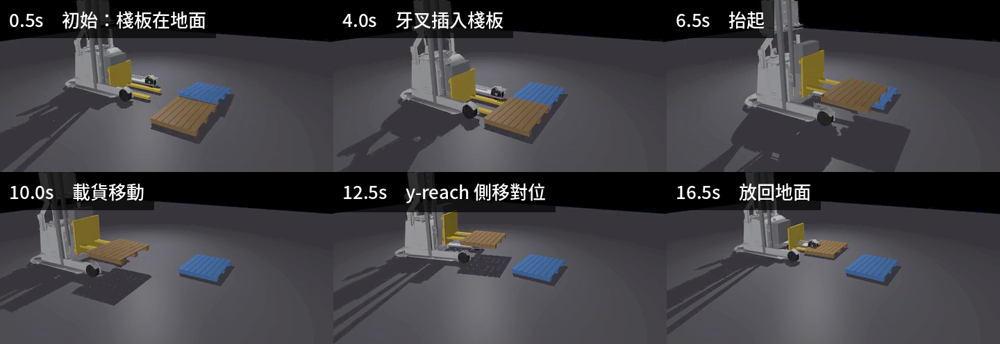

# 22｜y-reach 取放任務：錄影 + 6DOF 軌跡記錄

> 擷取日期：2026-09-10
>
> 測試環境：Linux、MuJoCo 3.12.0、Python 3.12.3、imageio/matplotlib；範例已實測通過。

## 學習目標

- 串聯完整 pick-and-place：對位 → 插入 → 抬起 → 搬運 → 放置 → 退出
- 錄製模擬影片（`mujoco.Renderer` + imageio → mp4）
- 記錄底盤與棧板的 x/y/z/roll/pitch/yaw（CSV + 軌跡圖）
- 閉迴圈 P 控制取代開環時間控制

## 前置知識

- [21｜y-reach 車型](09-yreach.md)、[11｜Viewer 與離屏渲染](../02-programming/06-viewer-rendering.md)

## 場景與任務

兩塊並排棧板（木頭 y=+0.45、塑膠 y=-0.45，各 20 kg）。任務：取木頭棧板，搬到塑膠棧板旁的空位放下。

```
靜置 → drive_to(0, 0.45) 對位 → drive_to(-0.95, 0.45) 後退插入
→ 抬起 2s → drive_to(0.4, 0.45) 退出貨架 → drive_to(0.4, -0.45) 橫移
→ reach 外伸 -0.45 → 放下 → drive_to(1.2, -0.45) 退出
```

底盤控制用閉迴圈 P 控制（`drive_to(tx, ty)`）— 誤差小自動減速，不會像開環時間控制那樣衝過頭。

## 實測結果

```
任務結束：木頭棧板位置 x=0.06 y=-0.55 z=-0.000   ← 從 (-1.35, 0.45) 搬來
runs/mission_log.csv: 951 筆（50 Hz）
runs/mission.mp4: 571 幀（30 fps，19 秒）
棧板被搬運了 1.75 m；搬運全程在牙叉座標系中的漂移峰值 14.3 cm
結果：取貨 → 搬運 → 放置 全程驗證通過 ✓
```

**漂移峰值 14.3 cm，是 [24 章](12-steer-reach-xz.md)（6.8 cm）的兩倍。** 差別在於這裡
沒有後傾：24 章全程保持 `tilt = 0.08 rad`，貨靠在滑架背板上；本章的 tilt 一直是 0，
貨純粹靠摩擦坐在叉齒上，起步與橫移的加速度直接讓它相對滑動。後傾在 [23 章](11-fork-cyclic.md)
量到的效果是把漂移從 22 cm 壓到 1.4 cm — 同一個機制。


軌跡解讀：棧板 z 在 t≈5.5 s 到最高的 0.54（抬起）、x 從 -1.35 跟到 0.06、y 從 0.45 跟到 -0.55（reach 外伸時一度到 -1.07）；roll/pitch 在插入與放置瞬間有小尖峰（接觸衝擊），其餘時間平穩。

[](../assets/strip_mission.png)

取放任務全程：牙叉插入 → 抬起 → 搬運 → 放回地面。

影片：[runs/mission.mp4](../../runs/mission.mp4)

## 錄影與記錄的做法

```python
renderer = mujoco.Renderer(model, 360, 640)
frames = []
while simulating:
    mujoco.mj_step(model, data)
    if int(data.time * 30) > len(frames) - 1:      # 30 fps
        renderer.update_scene(data, camera=cam, scene_option=opt)
        frames.append(renderer.render().copy())     # 見下方說明
imageio.mimsave("runs/mission.mp4", frames, fps=30)
```

6DOF 記錄：底盤直接讀 `qpos`（平面模型 x/y/yaw）；棧板是 freejoint，四元數轉 RPY：

```python
roll  = atan2(2(wx+yz), 1-2(x²+y²))
pitch = asin(2(wy-zx))
yaw   = atan2(2(wz+xy), 1-2(y²+z²))
```

## 除錯紀錄（本章血淚最多）

1. **開環對位衝過頭 0.13 m**：`vy=0.8 × 0.9s` 以為會到 0.45，實際到 0.576（速度伺服的加減速過程）— 叉齒撞到棧板枕木把貨推走。解法：閉迴圈 `drive_to`。
2. **叉齒間距對不上棧板枕木通道**（±0.315 vs 通道中心 ±0.21）：把棧板**整個鏟起來翻掉**。解法：回 Blender 把叉齒改到 ±0.21、縮窄到 0.1 m 寬 — 程序化建模改參數只要 30 秒。
3. **叉齒太高頂到板面**（prong top 0.10 vs deck bottom 0.09，1 cm 干涉）：把安裝高度降 0.015。
4. **freejoint 的 qpos 索引**：`mj_name2id(JOINT, body名)` 不一定對，用 `model.body_jntadr[body_id]` 最穩。
5. **`render(out=...)` 會讓所有影格變成同一張**：`renderer.render()` 不帶參數時每次配置新陣列（MuJoCo 3.12.0 實測），直接 append 是安全的；但傳 `out=buf` 重用同一個陣列時，清單裡每個元素都指向 `buf`，最後全部是最後一張。範例保留 `.copy()` 是防禦性寫法 — dm_control 的 `physics.render()` 確實共用緩衝區，這個習慣從那裡沿用下來。
6. **matplotlib 中文字型**：headless 環境預設 DejaVu Sans 沒有 CJK，圖表標題用英文（或額外裝字型）。

## 延伸閱讀

- [11｜離屏渲染](../02-programming/06-viewer-rendering.md)
- 下一步：雙棧板都搬（連續任務）、加入感測器回饋（觸覺確認插入深度）、或把軌跡與真機 odometry 對照
