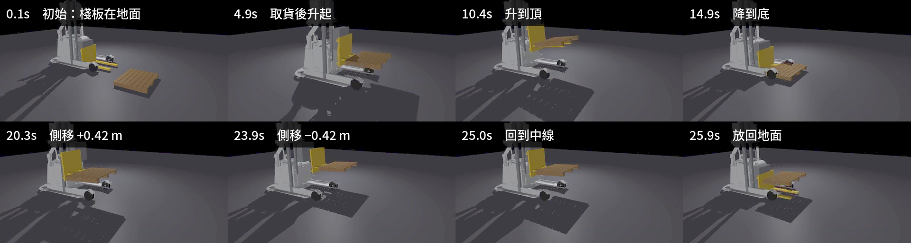

# 23｜連續動作實驗：牙叉上上下下 ×3 + 左右左右 ×3（錄影）

> 擷取日期：2026-09-10
>
> 測試環境：Linux、MuJoCo 3.12.0、Python 3.12.3、imageio；範例已實測通過。

## 學習目標

- 載著 20 kg 棧板做連續循環動作：升降 ×3 + reach 側移 ×3
- 全程錄影 + 記錄 6DOF 與相對滑動
- 學會用「後傾」防止載貨在循環中蠕動（真實叉車技巧）

## 前置知識

- [22｜y-reach 取放任務](10-yreach-mission.md)

## 實驗設計（`scripts/ex_fork_cyclic.py`）

```
取貨（同 22 章）→ 抬起
→ 升降循環 ×3：lift 0.45 → 0.15 → 0.45（tilt 後傾 0.08 rad）
→ 側移循環 ×3：reach +0.35 → -0.35
→ 放下
```

記錄：50 Hz CSV（底盤、lift、reach、棧板 6DOF、棧板在牙叉座標系的相對位置）+ 30 fps 影片。

## 實測結果

```
抬起 z = 0.602 m
連續動作期間的漂移：終點 1.4 cm、峰值 19.6 cm（基準：取貨完成時）
最終棧板 z = 0.000（放下）
runs/fork_cyclic.mp4: 831 幀（27.7 秒）
結果：連續上上下下左右左右驗證通過 ✓
```

[](../assets/strip_fork_cyclic.png)

升降與側移的極值畫面 — 每格取自升到頂、降到底、側移兩端這些轉折點。

影片：[runs/fork_cyclic.mp4](../../runs/fork_cyclic.mp4)

## 除錯紀錄

1. **「抬起失敗」其實是腳本 bug**：量測 z 之前插了一段 `drive_to`，而 `drive_to` 的控制向量把 lift 歸零 — 棧板被放回去了。教訓：**共用控制函式的預設值會偷改你以為不變的通道**。
2. **循環中棧板向叉尖蠕動 22 cm**：每次「下」到底的衝擊讓棧板一點點往前走。解法是真實叉車的標準做法 — **後傾（tilt +0.08 rad）把貨靠在滑架背板上**，終點漂移從 22 cm 降到 1.4 cm。
3. **終點 1.4 cm 不等於全程都只滑 1.4 cm**：追蹤整段軌跡後，過程中的峰值是 **19.6 cm** — 貨在每次升降與側移的加速段滑出去，後傾又把它帶回背板。判定實驗成敗要看整段，只印最後一幀會低估。（24 章是同一件事：終點 1.0 cm、峰值 6.8 cm。這裡的循環動作更劇烈，所以峰值大得多。）
4. **峰值只能算「貨還在叉齒上」那段**：放下之後叉齒繼續下降，棧板相對叉齒的位置本來就會變（實測 `rel_z` 從 0.095 跳到 0.275）。沒排除這段的話會把卸貨動作算成 45.6 cm 的漂移。
5. **滑動量測的基準**：「相對牙叉位置」是絕對值（取貨後約 -0.65 m），漂移量要拿「取貨完成時」當基準相減，不能直接對零點判斷。

## 延伸閱讀

- [16｜棧板摩擦實驗](04-pallet-materials.md)（急側移下的材質差異）
- 下一步：把循環動作改成 sinusoidal 掃頻，量測系統振動特性；或加快節奏找棧板滑落的臨界循環頻率
