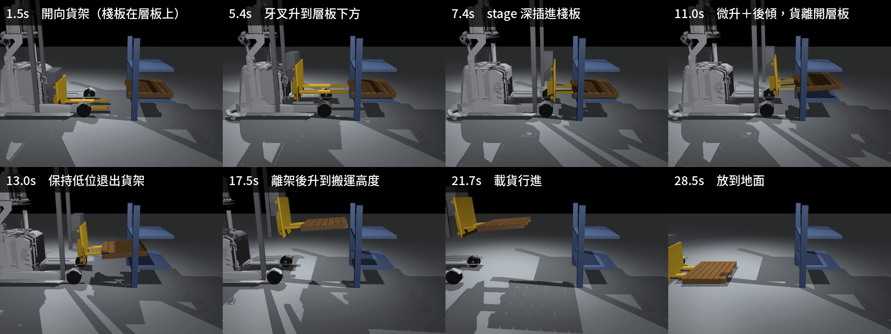

# 24｜真實化重跑（一）：舵輪底盤 + 環氧地板 + 貨架原地取放（reach X/Z）

> 擷取日期：2026-09-10
>
> 測試環境：Linux、Python 3.12.3、MuJoCo 3.12.0、timestep 0.0005；範例已實測通過。

## 學習目標

- 把平面簡化底盤升級成**真實輪系**：前雙固定輪 + 後舵輪（swivel 轉向 + drive 驅動），freejoint 底盤靠輪地摩擦驅動
- 地板材質：環氧樹脂地坪（μ=0.7）
- 貨架情境：原地不動，用 stage（reach X）+ lift（Z）從層板取貨、搬出、放下

## 前置知識

- [18｜MR1533 mesh 叉車](06-mr1533-mesh.md)、[20｜新模型重跑](08-rerun-real-model.md)

## 模型（`models/mr1533_steer.xml`）

依 TB3 `mr1533_light.urdf` 的關節配置：

- 底盤 freejoint；前輪 `roll_fl/fr`（hinge，僅滾動）；後舵輪 `swivel`（hinge z，轉向 ±90°）+ `drive`（hinge y，velocity 驅動）
- 門架含 `stage`（prismatic x，reach X，URDF 的 -0.7~0 m）、兩段 lift、`tilt`、y-reach
- 地板 `friction="0.7 0.05 0.01"`（環氧樹脂）

### 舵輪底盤的兩個關鍵坑

1. **驅動輪與底盤碰撞盒卡死**：輪子在底盤碰撞盒範圍內會被摩擦鎖死（actuator 647N vs 約束力）— 用 `<contact><exclude>` 排除 base↔swivel/drive。
2. **接觸剛性**：輪地接觸 + 大 kp 轉向在 0.002s timestep 下發散（NaN QACC）— 降到 0.0005s 才穩定。

## 實驗（`scripts/ex_reach_xz.py`）

貨架（前雙柱 ±0.60、上下兩層層板，取貨的那層 z=0.35）+ 木頭棧板（20 kg）放層板上。
完整流程：取貨 → 退出 → 升高 → 搬運 → 放到地面。

```
drive_to(-0.65) → lift1=0.39（叉齒對準層板下方空隙）
→ stage -0.65（reach X 深插，叉尖到棧板重心後方；之後全程保持不收回）
→ 微升 lift1=0.48/lift2=0.08（+4 cm 離開層板）＋ tilt 0.08 後傾
→ 保持低位開到 x=0.3（**先退出貨架**）
→ 離架後才升到搬運高度 lift1=0.70/lift2=0.35
→ 開到 x=1.5 → 放低 lift1=0.02 → tilt 歸零
```

實測結果：

```
微升後棧板 z = 0.485
退出後棧板 z = 0.485
搬運高度棧板 z = 0.976
放下後棧板 = [ 0.575  0.002 -0.   ]
棧板被搬運了 2.07 m；搬運全程在牙叉座標系中的漂移峰值 6.8 cm
結果：取貨 → 搬運 → 放置 全程驗證通過 ✓
```

[](../assets/strip_reach_xz.png)

從貨架層板取貨到放回地面的八個階段。注意第 5 格：貨保持在低位退出貨架，離架之後才升高。

影片：[runs/reach_xz.mp4](../../runs/reach_xz.mp4)

### 三個讓這個流程成立的關鍵

這章的流程改對之前，貨會在半路翻覆掉落（牙叉座標系漂移 110 cm）。三個修正缺一不可，
每一個單獨做都不夠：

**一、深插之後不要收回 stage。** 原本的序列在「升到搬運高度」那一步把 `stage` 從 -0.65
設回 0，棧板的支撐點瞬間退到叉尖，roll 立刻掉到 -63°（翻了）。只要在後續每個 `step`
與 `drive_to` 都把 `stage=-0.65` 傳下去，roll 就保持在 0.1° 以內。

**二、先退出貨架再升高。** 搬運高度（lift1=0.70/lift2=0.35）讓棧板頂面到 0.842 m，而貨架
上層層板底面在 0.85 m —— **只剩 8 mm**。在架內升高幾乎必然擦撞。真實叉車也是先退出來
再升，這裡照做。

**三、航向目標要對。** `drive_to` 原本把目標航向寫死成 π，但車體的 -x 側就是牙叉、貨架
也在 -x，**車子從 yaw=0 出發時朝向本來就是對的**。目標設 π 等於要求它原地轉 180°，而舵輪
車做不到，只能邊爬邊轉；更糟的是航向誤差會透過 `max(0.15, 1-|herr|)` 把速度壓到 15%，
於是車子以 0.03 m/s 龜速前進、20 秒只轉了 19°。改成目標 0 之後，`herr` 全程小於 0.5°，
車子正常行駛。

配合後傾 0.08 rad 與保守的速度上限（線速度約 0.23 m/s），搬運全程的漂移**峰值 6.8 cm**，
到終點時收斂到 1.0 cm。

> 峰值與終點值的差距本身值得注意：貨在起步加速時滑出去幾公分，後傾又把它帶回背板。
> 只印最後一幀的漂移會低估過程中的風險 —— 驗收要看整段軌跡的峰值，這也是腳本裡
> `track_drift()` 存在的理由。

> 對照 [23 章](11-fork-cyclic.md)：那裡在原地做升降與側移循環，後傾把漂移從 22 cm 壓到
> 1.4 cm。這裡多了行進，同樣的手法把 110 cm 壓到 1.0 cm。**貨靠上滑架背板，是叉車載貨
> 移動的前提。**

## 除錯紀錄（本章血淚最長）

1. **叉齒高度算錯**：實測叉尖 z 與手算差 8 cm — **永遠用 `site_xpos` 量測驗證，不要相信心算**。
2. **棧板卡在貨架裡**：層板上的棧板被立柱四面圍住，直直往上抬會把棧板夾在柱間 — 先「微升 4 cm 離開層板」才能動；且貨架立柱間距要比棧板枕木寬（我們從 ±0.45 一路調到 ±0.60）。
3. **stage 收回時棧板被甩在叉尖上傾斜**：摩擦拖曳不可靠 — 改為**一開始就深插到位**（支撐邊緣超過重心），完全省略收回步驟，一次成功。
4. **共用 `drive_to` 會把通道歸零**：不只 lift，`stage`、`tilt`、`reach` 全都一樣。載貨行進
   時 stage 被歸零就等於把叉齒抽掉一半，貨立刻翻。現在這幾個通道都是 `drive_to` 的參數，
   呼叫端必須明確傳入要保持的值。這個坑在第 22、23、25 章各出現過一次，是本專案累犯最多的
   一種。
5. **判定條件寫「抬起來過」，就驗不到「後來掉了」**。本章一度用「棧板最終高度夠低」當通過
   條件 — 貨掉在地上也滿足。現在驗四件事：抬離層板、牙叉座標系漂移 < 10 cm、搬運距離
   > 1.5 m、最終落到地面，缺一不可。
6. **量滑動要用牙叉座標系**。用世界座標算「車位移減貨位移」會把轉向造成的幾何位移算進去；
   車子在轉時那個數字沒有意義。改量棧板在 `yreach` body 座標系中的位置變化（同 23 章）。
7. **航向控制的目標值要對著機構的朝向設**。牙叉在車體 -x 側，目標航向就該是 0 而不是 π。
   設錯的代價不只是繞路 — 航向誤差會透過減速項把速度壓到 15%，看起來像「車子推不動」，
   很容易誤診成驅動力不足或摩擦問題。

## 延伸閱讀

- [25｜真實化重跑（二）：reach X/Y/Z 全軸取放](13-reach-xyz.md)
