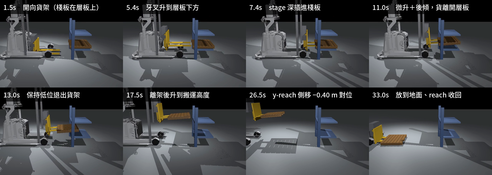

# 25｜真實化重跑（二）：reach X/Y/Z 全軸取放

> 擷取日期：2026-09-10
>
> 測試環境：Linux、Python 3.12.3、MuJoCo 3.13.0、timestep 0.0005；範例已實測通過。

## 學習目標

- 在 24 章基礎上加入 **y 向 reach**：stage（X）插入 → lift（Z）抬取 → reach（Y）側移 → 放低（Z）

## 前置知識

- [24｜舵輪底盤 + 貨架原地取放](12-steer-reach-xz.md)

## 實驗（`scripts/ex_reach_xyz.py`）

同 24 章場景與流程，在放置前多一段 y 向 reach 側移對位：

```
drive_to(-0.65) → lift1=0.39 → stage -0.65（X 深插，之後全程保持）
→ 微升 lift1=0.48/lift2=0.08 ＋ tilt 0.08 後傾
→ 保持低位退出貨架 → 離架後升到 lift1=0.70/lift2=0.35
→ 開到 x=1.5 → **reach -0.40（Y 側移對位）** → 放低 lift1=0.02 → reach 收回
```

三個軸各負責一件事：**X**（stage）把叉齒送進層板下方、**Z**（lift）把貨抬起與放下、
**Y**（reach）在放置前橫向對位，不必轉動車身。

實測結果：

```
微升後棧板 z = 0.484
搬運高度棧板 z = 0.974
側移後棧板 y = -0.487
放下後棧板 z = -0.000
最終棧板 = [ 0.672  0.014 -0.   ]
棧板被搬運了 2.17 m；搬運全程在牙叉座標系中的漂移峰值 12.1 cm
結果：reach X/Y/Z 取貨 → 搬運 → 側移對位 → 放置 全程驗證通過 ✓
```

[](../assets/strip_reach_xyz.png)

比 24 章多一段 y 向 reach 側移對位。

影片：[runs/reach_xyz.mp4](../../runs/reach_xyz.mp4)

## 討論

**側移的傳遞比 24 章的直線行進鬆一些**：漂移峰值 12.1 cm，而純直線的 24 章是 6.7 cm。
更值得注意的是**峰值之後會不會收回來**：24 章的貨在行進中滑出去，後傾把它壓回背板，貨離
叉齒前只剩 0.1 cm；這一章側移造成的 11.1 cm 到最後幾乎原封不動。reach 滑台橫移時貨要靠
摩擦跟著走，橫向加速度直接作用在接觸面上，**沒有背板可靠** —— 後傾擋得住前後方向的滑動，
擋不住側向，於是貨停在新位置就留在那裡。要更準的側向對位，得放慢 reach 的速度，或接受這個
量級的誤差、事後用量測修正。這與 16、20 章的摩擦實驗結論一致：摩擦傳遞在加速段一定會打折，
差別只在打多少。

**y 向 reach 的價值**：不轉車身就能橫向對位 0.4 m。在窄通道裡，轉車身需要的空間遠大於
伸出滑台，這是這個機構存在的理由。

## 常見錯誤與除錯

- **「放低」不等於「放下」**。要確認貨真的轉移到地面，量的是棧板 z 有沒有降到接近 0，
  而不是 `lift` 命令值降到多少。本章的驗收明確檢查 `pz < 0.10`。
- **共用的 `drive_to` 會覆寫升降、stage、tilt、reach 四個通道**。載貨行進時要保持的值
  必須全部傳進去；漏傳 `stage` 貨會翻，漏傳 `hold` 貨會被放回去或重新舉起。
- **側移對位不要看命令值**。`reach` 命令 -0.40 m，棧板實際跟隨多少要量世界座標 —— 摩擦
  傳遞在加速段一定會打折。
- **判定條件只寫終點位置，會把「掉下去」算成「放下去」**。位置條件要配合過程檢查（貨在
  牙叉座標系的漂移、搬運距離），三者一起看才分得出來。
- **叉齒滑台低位橫移會掃進前輪**。叉齒在最低位時，`reach_y` 落在 ±0.144 ～ ±0.344 m
  這段會與輪子的碰撞盒重疊。本章的側移 -0.40 m 會經過這個區間，只是發生在搬運高度所以
  沒踩到 — 模型層面仍然是錯的（見 24 章除錯紀錄第 8 條），已用 `<contact><exclude>` 排除。
- 24 章的八條除錯紀錄在本章同樣適用，尤其是深插不收回、先退出貨架再升高、航向目標要對著
  機構朝向設這三條。

## 延伸閱讀

- [26｜真實化重跑（三）：搬運車夾爪 A 取 B 放](14-gripper-ab.md)
