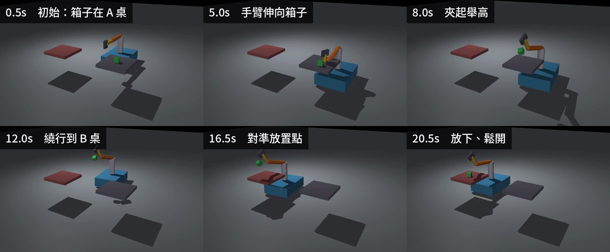

# 26｜真實化重跑（三）：搬運車夾爪 A 取 B 放

> 擷取日期：2026-09-10
>
> 測試環境：Linux、Python 3.12.3、MuJoCo 3.13.0；範例已實測通過。

## 學習目標

- 搬運車 + 三軸手臂 + 二指夾爪（`models/mm_gripper.xml`）
- A 桌取箱、運到 B 桌放下
- 學會 MuJoCo 抓取的正規技巧：**weld 約束 + 啟動時寫入當前相對位姿**

## 前置知識

- [14｜車載手臂 IK](02-mobile-manipulator.md)

## 實驗（`scripts/ex_gripper_ab.py`）

```
開到 A 桌旁 → IK 到箱子上方 → 垂直放下 → 夾爪閉合
→ weld 抓取啟動 → IK 抬高 0.3m → 三段繞行到 B 桌旁
→ IK 放置 → 放鬆 weld → 抬高 → 張開 → 退開
```

實測結果：

```
weld 抓取啟動（rel_pos=[-0.062 0.021 -0.129]）
箱子 z = 0.616（成功抬起）
箱子最終位置 = [0.91 -0.495 0.43]   ← B 桌面上 ✓
箱子最高到過 z=0.647（起點 0.460，抬升 18.7 cm）
結果：A 取 B 放驗證通過 ✓
```

[](../assets/strip_gripper.png)

方塊從 A 台被夾起、搬到 B 台放下。

影片：[runs/gripper.mp4](../../runs/gripper.mp4)

## 關鍵技巧：weld 抓取（不重吸）

純摩擦夾爪對 60 mm 箱子需要 mm 級對位，很難穩定。模擬界的標準做法是 **weld equality constraint**：夾爪到位後啟動焊接，到放置點放鬆。

⚠️ **最大的坑**：直接 `eq_active=1` 會把箱子**瞬間吸到 anchor 點**（影片中箱子飛上天）。正確做法是啟動前把**當前相對位姿**寫入 `model.eq_data`：

```python
rel_pos = R_fl.T @ (data.xpos[box] - data.xpos[finger])
model.eq_data[0, 3:6] = rel_pos      # relpos
model.eq_data[0, 6:10] = rel_quat    # 相對姿態
data.eq_active[0] = 1                # 箱子原地被固定，不會跳
```

> 「抬升 18.7 cm」那行是過程檢查。只比對終點位置的話，箱子被夾爪**推**到 B 桌也會
> 算通過 —— 判定要能區分「搬過去」與「推過去」。

## 除錯紀錄

1. **夾爪指面剛好碰到但夾力 ≈ 0**：閉合行程終點等於箱寬時，彈簧力為零 — 要留過行程（over-travel）讓 `kp×(ctrl−實際)` 產生正向力。
2. **手臂下降過程把箱子掃走**：要兩段式 — 先到箱子上方，再垂直放下。
3. **位置伺服的穩態誤差（又見 03 章）**：ee 比 IK 目標低 4.8 cm — 以實際位置再做一次 IK 修正，或接受並用動態目標（即時箱位）對齊。
4. **吊著的箱子卡到桌面把車拖住**：運送路徑要三段繞行（退出 → 直行 → 進入），且抬高用 IK 到「箱子上方 0.3 m」而非手調關節角。

## 延伸閱讀

- [Weld equality — XML Reference](https://mujoco.readthedocs.io/en/stable/XMLreference.html#equality-weld)
