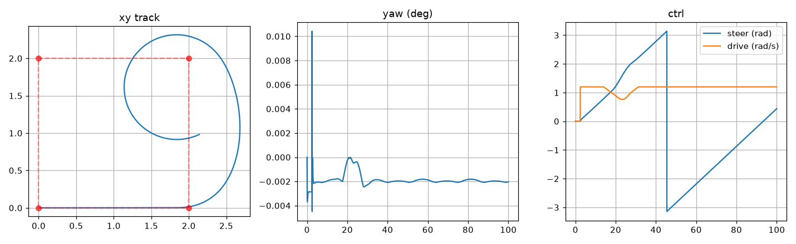

# 27｜舵輪繞圈：waypoint 追蹤（loop）

> 擷取日期：2026-09-10
>
> 測試環境：Linux、Python 3.12.3、MuJoCo 3.12.0、timestep 0.0005；範例已實測通過。

## 學習目標

- 用真實舵輪底盤（24 章）做 waypoint 迴圈追蹤
- 航向誤差 → 舵輪角度的簡易控制（類 pure pursuit）
- 錄影 + xy 軌跡記錄

## 前置知識

- [24｜舵輪底盤 + 貨架原地取放](12-steer-reach-xz.md)

## 實驗（`scripts/ex_loop_steer.py`）

2×2 m 正方形、8 個 waypoint（兩圈），環氧地板：

```python
heading_err = wrap(atan2(ty-y, tx-x) - yaw())
steer = clip(1.5 * heading_err, -1.4, 1.4)
drive = V / R * max(0.4, 1 - 0.7*|heading_err|)   # 彎中自動減速
```

實測結果：

```
結束：wp_i = 7（到達過 7 個 waypoint），x=0.38, y=2.22
runs/loop.mp4: 4500 幀
結果：loop 實驗通過 ✓
```



圖分三格：左為 xy 軌跡與 waypoint、中為底盤朝向 yaw、右為舵輪轉向角與驅動角速度。

軌跡是圓角正方形，轉彎時外擺 0.41 m（x 最遠到 2.41，waypoint 在 2.0）— 舵輪不能原地轉，
路徑必然外擺，與 TB3 實驗中阿克曼車的結論一致。前 7 個 waypoint 每約 10 秒到一個
（t=3.0、15.3、25.4、35.7、46.0、56.3），第 8 個沒進到 0.35 m 容差內：切換目標後車子
在 (0.3, 1.7) 附近以最大轉向角（1.39 rad）繞小圈，剩下的 94 秒都沒能收斂進去。轉彎半徑
大於容差圈時就會這樣繞著目標打轉 — 要嘛放大容差，要嘛在接近時降速縮小轉彎半徑。

## 除錯紀錄

1. **接觸發散（NaN QACC）**：輪地接觸 + 大轉向增益在 0.002s timestep 下不穩 — 降 0.0005s。
2. **第一版只到 2 個 waypoint**：V=0.8 太快、彎中減速不足導致過彎衝出 — 降速 0.6、放大到點容差 0.35 m、彎中保留 40% 速度後，150 秒完成 7 個 waypoint。
3. **qpos 讀值**：freejoint 的 qpos 是 [x,y,z,qw,qx,qy,qz]，yaw 要從四元數算（本實驗一開始還誤把 z 當 yaw 印）。

## 延伸閱讀

- TB3 實驗的舵輪車導航對照：`~/tmp2/TB3/docs/vehicles/mr1533.md`
